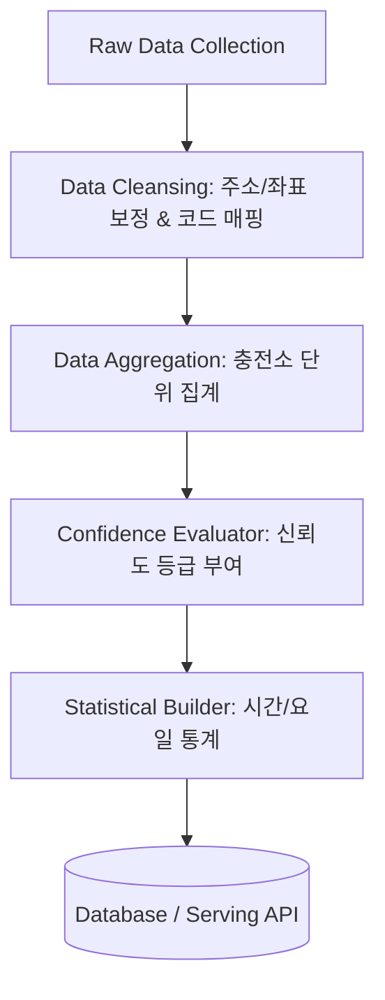

# 전기차 충전소 실시간 데이터 파이프라인 - 데이터 가공 (Data Processing)

이 프로젝트는 대구광역시 실시간 전기차 충전소 데이터를 기반으로, 수집된 원본 데이터를 정제 및 집계하여 신뢰할 수 있는 데이터 서비스를 제공하는 파이프라인입니다. 

본 파트는 수집 레이어(Collection)와 서빙 레이어(API/Web)의 교두보 역할을 하며, 원본 데이터 가공 및 정합성 검증을 전담합니다.

---

## 🛠️ 담당 역할 및 핵심 업무

### 1. 원본 데이터 정제 (Data Cleansing)
* **좌표·주소 정합성 검증**:
  * 수집된 충전소의 위도(Latitude)와 경도(Longitude) 값이 대구광역시 행정 구역 및 유효 범위 내에 있는지 정합성을 검증합니다.
  * 누락되거나 비정상적인 지번 주소/도로명 주소를 카카오/네이버 로컬 API 역지오코딩 등을 활용하여 보정합니다.
* **충전기 타입 코드 매핑**:
  * 공공데이터 API 등에서 전달하는 기관별 상이한 충전기 타입 코드(예: `01`, `02` 등)를 표준 공통 코드 테이블과 매핑하여 일관된 정보로 변환합니다.
    * *예: `01` ➡️ `DC차데모`, `02` ➡️ `AC완속`, `03` ➡️ `DC콤보`*
* **결측치 및 예외 처리**:
  * 충전기 ID가 누락되었거나 상태 값(`stat`)이 알 수 없음으로 들어오는 경우에 대한 결측값 대체 및 필터링 정책을 적용합니다.

### 2. 충전소 단위 집계 (Station Aggregation)
* 개별 충전기(Charger) 단위로 수집되는 로우(Raw) 데이터를 충전소(Station) ID 기준으로 그룹화(Group-by)하여 실시간 모니터링용 통계를 산출합니다.
* **집계 지표**:
  * `total_chargers` (전체 충전기 수)
  * `available_chargers` (즉시 사용 가능한 충전기 수 - 대기 상태)
  * `charging_chargers` (현재 충전 중인 충전기 수)
  * `broken_chargers` (점검 중이거나 고장 상태인 충전기 수)

### 3. 상태 갱신 시각 기반 신뢰도 등급 계산 (Confidence Level)
* 오픈 API 데이터의 특성상 실제 현장 상태와 DB 반영 시각 간에 차이가 발생할 수 있습니다. 
* 충전기의 최종 상태 변경 시각(`statUpdDt`)과 현재 가공 시각을 비교하여 신뢰도 등급을 동적으로 계산합니다.
  * 🟢 **높음 (High)**: 마지막 갱신이 **5분 이내**인 경우 (실시간성 우수)
  * 🟡 **보통 (Medium)**: 마지막 갱신이 **5분 초과 ~ 15분 이내**인 경우
  * 🔴 **확인 필요 (Low)**: 마지막 갱신이 **15분 초과**인 경우 (현장 상태와 다를 확률 존재)

### 4. 시간대·요일별 이용 패턴 통계 (Pattern Analytics)
* **이전 혼잡 기록 분석**:
  * 수집 및 가공 주기에 맞춰 각 충전소별 시간대(00시~23시) 및 요일(월~일) 단위의 충전기 사용률(`charging_chargers / total_chargers`)을 누적 통계 데이터로 가공합니다.
* **기반 데이터 제공**:
  * 가공된 통계 데이터는 시계열 데이터 모델 또는 추후 확장될 AI 기반 충전 혼잡도 예측 모델의 학습용 피처 데이터(Feature Data)로 안전하게 적재됩니다.

---

## 🗂️ 데이터 가공 파이프라인 흐름



---

## 📊 산출물 데이터 스키마 (예시)

### 가공 후 충전소 요약 데이터 (JSON)
```json
{
  "station_id": "ST-10293",
  "station_name": "대구시청 동인청사 주차장",
  "address": "대구광역시 중구 공평로 88",
  "coordinate": {
    "latitude": 35.8714,
    "longitude": 128.6014
  },
  "summary": {
    "total_chargers": 5,
    "available_chargers": 2,
    "charging_chargers": 2,
    "broken_chargers": 1
  },
  "confidence_level": "High",
  "last_update_time": "2026-07-15T17:05:00+09:00"
}
```