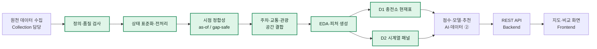

# EV SafeCharge

> **도착했을 때 실제로 충전할 수 있는 충전소를 찾는 추천 서비스**<br>
> 팀 프로젝트 · 개인 담당: **이현석 / AI·데이터 ① 데이터·파이프라인**

단순히 가까운 충전소를 보여주는 대신, 실시간 충전기 상태와 정보 신선도, 충전기 수, 교통·주차 데이터를 결합해 **도착 시 충전 실패 위험이 낮은 후보**를 추천하는 프로젝트입니다.

저는 팀에서 원천 데이터를 바로 추천에 사용하지 않고, **정의 → 품질 검증 → 시점 정합성 처리 → 공간 결합 → EDA → 피처·데이터셋 생성 → 모델 담당자 핸드오프**까지 연결하는 데이터 파이프라인을 담당했습니다.

> **최종 상태:** `DA1_READY_FOR_DA2_MODEL_EVALUATION`<br>
> **데이터 기준시각:** 2026-08-09 07:23:21 KST<br>
> **검증 결과:** 담당 역할 8개 항목 모두 완료 — [역할 완료 검증서](./docs/데이터파트_①_역할완료_검증_20260809.md)

---

## 프로젝트 요약

### 문제

전기차 충전소는 가까워도 다음과 같은 이유로 실제 충전에 실패할 수 있습니다.

- 이동 중 충전기 상태가 바뀔 수 있음
- API 상태가 오래 갱신되지 않아 현재 상태를 신뢰하기 어려움
- 충전기가 1대뿐이거나 고장·점검 비율이 높음
- 주차·교통·운영 조건 때문에 접근이 어려움

### 해결 방향

충전소의 거리만 비교하지 않고 다음 정보를 함께 사용할 수 있는 추천 입력 데이터를 설계했습니다.

- 사용 가능한 충전기 수와 관측 가용률
- 상태 갱신 후 경과시간과 실제 관측 신선도
- 충전소별 전체 충전기 수와 관측 커버리지
- 공용·이용 제한 여부
- 주변 주차장, 교통 속도, 돌발 교통정보
- 시간대·요일·과거 상태 변화

### 나의 역할

| 구분 | 담당 내용 | 대표 결과 |
|---|---|---|
| 데이터 정의 | 출처·키·행 단위·기준시각·갱신주기 정의 | 데이터 사전, 데이터셋 명세 |
| 품질 검증 | 결측·중복·좌표·시간·상태 코드 검사 | 품질 게이트와 실패 원인 기록 |
| 전처리 | 상태 표준화, 최신 레코드 선택, 미관측 분리 | 재현 가능한 정제·집계 코드 |
| 시점 정합성 | 기준시각 이후 정보 차단, 장기 공백 보간 중단 | as-of 처리, 25분 gap-safe 패널 |
| 공간 결합 | 충전소와 주차·교통·관광 데이터를 거리 기반 결합 | 매칭률과 미매칭 목록 관리 |
| EDA·피처 | 시간대·요일·규모·신선도별 가용성 분석 | 추천·학습 입력 피처 정의 |
| 데이터셋 | 충전소 현재표 D1과 시계열 패널 D2 생성 | DA② 모델 담당자 핸드오프 |
| 검증·문서화 | 단위 테스트, 메타데이터, 한계와 계약 기록 | 역할 완료 8/8 검증 |

---

## 데이터 파이프라인



초록색 단계가 제 담당 범위입니다. 원본 API 수집 코드는 수집 담당, 점수·모델·추천 이유는 AI·데이터 ②, 서비스 API와 화면은 각각 백엔드·프론트엔드 담당입니다.

---

## 핵심 결과

| 결과 | 규모 | 의미 |
|---|---:|---|
| 충전기 마스터 | 25,368기 | 충전기 단위 기본정보 기준 |
| **D1 충전소 현재표** | **4,210곳** | 기준시각별 충전소 1곳 = 1행 |
| 좌표 정상 충전소 | 4,201곳 | 공간 결합 가능한 좌표 품질 확보 |
| **D2 시계열 패널** | **9,118,083행** | 충전소 × 관측시점 학습·분석 테이블 |
| 패널 관측시점 | 2,960개 | 시계열 변화와 도착 시점 라벨 구성 기반 |
| 주차장 1km 결합 | 3,922곳 · 93.2% | 실데이터 기반 주차 보조 피처 |
| 링크 속도 결합 | 2,716곳 | 주변 도로 속도 보조 정보 |
| 돌발 교통 1km 결합 | 942곳 · 22.4% | 사고·공사 등 제한적 보조 정보 |
| 공용 기본 추천 후보 | 1,853곳 | 이용 제한 충전소와 분리한 후보 풀 |

수치는 [D1 핸드오프 메타데이터](./apps/data-pipeline/evaluation/results/datasets/handoff_to_model/HANDOFF_META.json)와 [D2 핸드오프 메타데이터](./apps/data-pipeline/evaluation/results/datasets/handoff_to_model/HANDOFF_META_D2.json)를 기준으로 작성했습니다.

### D1과 D2를 분리한 이유

| 데이터셋 | 행 단위 | 사용 목적 |
|---|---|---|
| **D1 `station_feature_snapshot`** | 충전소 1곳 × 기준시각 | 규칙 기반 MVP와 서비스 후보 조회 |
| **D2 `station_feature_panel`** | 충전소 1곳 × 관측시점 | 시간 변화 분석과 모델 학습·평가 |

D1은 “지금 추천에 사용할 현재표”, D2는 “시간에 따라 상태가 어떻게 변했는지 보는 시간표”입니다. 두 데이터셋 모두 행 단위와 기준시각을 명시해 같은 입력에서 결과를 재현할 수 있도록 했습니다.

---

## 데이터 신뢰성을 높인 핵심 설계

### 1. 미관측을 사용 불가로 처리하지 않음

API에서 상태를 확인하지 못한 충전기를 곧바로 `사용 불가`로 간주하면 가용률이 왜곡됩니다. 따라서 **미관측과 사용 불가를 분리**하고, 관측된 충전기만 분모로 사용하는 `availability_ratio_observed`를 만들었습니다.

### 2. 상태 시각과 관측 시각을 분리

- `statUpdDt`: 제공기관이 기록한 충전기 상태 변경 시각
- `last_seen_at`: 수집 파이프라인이 실제로 상태를 확인한 시각

두 시각을 분리해 “상태가 오래 유지된 것”과 “데이터를 오랫동안 받지 못한 것”을 구분했습니다. 관련 구현은 [`status_as_of.py`](./apps/data-pipeline/processing/features/status_as_of.py), [`station_features.py`](./apps/data-pipeline/processing/features/station_features.py), [`reliability.py`](./apps/data-pipeline/processing/core/reliability.py)에서 확인할 수 있습니다.

### 3. 미래 정보가 과거 행에 들어가지 않도록 차단

각 기준시각에서 `statUpdDt ≤ as_of_ts`인 최신 상태만 선택했습니다. 모델 학습 시 미래 상태를 미리 본 것처럼 섞이는 **시간 누수**를 방지하기 위한 처리입니다.

### 4. 긴 수집 공백을 무리하게 채우지 않음

D2 패널은 상태 공백이 25분을 넘으면 이전 값을 계속 복사하지 않습니다. 오래된 값을 현재 상태처럼 사용하는 오류를 막는 로직은 [`gap_safe_panel.py`](./apps/data-pipeline/processing/features/gap_safe_panel.py)와 [`test_gap_safe_panel.py`](./apps/data-pipeline/evaluation/tests/test_gap_safe_panel.py)에 구현했습니다.

---

## EDA에서 확인한 패턴

### 오전과 저녁의 가용성 차이

2026-07-17부터 2026-08-08까지 수집된 상태 패널을 시간대별로 집계했을 때, 오전 8~11시 관측 가용률은 약 **79.1%**, 오후 6~9시는 약 **68.8%**였습니다. 이 차이를 시간대 피처 후보로 반영했습니다.


이 결과는 수집된 관측치의 기술통계이며, 사용자별 충전 성공 확률이나 인과관계를 의미하지 않습니다. 날짜별 수집량 차이와 관측 공백은 별도의 품질 지표로 관리했습니다.

### 보조 데이터마다 다른 공간 커버리지

주차장은 충전소 3,922곳과 연결됐지만, 돌발 교통정보는 942곳에만 연결됐습니다. 따라서 주차 정보는 넓게 활용할 수 있는 반면, 돌발 정보는 모든 충전소에 동일하게 적용하지 않고 **관측된 곳에서만 사용하는 보조 신호**로 제한했습니다.


---

## 모델 담당자에게 넘긴 계약

- D1 기본 후보는 `recommend_public_default=true`로 제한
- `미관측 ≠ 사용 불가` 정책 유지
- 가용률은 관측된 사용 가능 상태를 기준으로 계산
- 주차·교통 미매칭 값은 임의의 평균이나 mock으로 채우지 않고 `null` 유지
- D1의 사용자별 ETA는 백엔드·TMAP 단계에서 입력
- 점수 가중치, 위험도, Top-N, 추천 이유, 모델 성능은 AI·데이터 ②가 결정

상세 정의는 [데이터 사전](./docs/data/스키마/데이터_사전.md), [상태 코드 매핑](./docs/data/스키마/상태코드_매핑.md), [피처 카탈로그](./docs/data/스키마/피처_카탈로그.md), [데이터셋 명세](./docs/data/스키마/데이터셋_명세.md)에 남겼습니다.

---

## 핵심 코드와 검증 근거

| 영역 | 주요 파일 |
|---|---|
| 상태 기준시각 처리 | [`status_as_of.py`](./apps/data-pipeline/processing/features/status_as_of.py) |
| 충전소 피처 생성 | [`station_features.py`](./apps/data-pipeline/processing/features/station_features.py) |
| 장기 공백 안전 처리 | [`gap_safe_panel.py`](./apps/data-pipeline/processing/features/gap_safe_panel.py) |
| 신뢰도 등급 | [`reliability.py`](./apps/data-pipeline/processing/core/reliability.py) |
| 충전기 품질 규칙 | [`charger_quality.py`](./apps/data-pipeline/processing/core/charger_quality.py) |
| 전체 단위 테스트 | [`evaluation/tests/`](./apps/data-pipeline/evaluation/tests/) |
| D1·D2 샘플과 메타데이터 | [`handoff_to_model/`](./apps/data-pipeline/evaluation/results/datasets/handoff_to_model/) |
| 역할 완료 근거 | [AI·데이터 ① 역할 완료 검증](./docs/데이터파트_①_역할완료_검증_20260809.md) |
| 개인 코드 인덱스 | [DA1 핵심 코드 인덱스](./apps/data-pipeline/DA1_핵심코드_인덱스.md) |

---

## 실행 방법

Python 3.11 이상을 권장합니다.

```powershell
# 가상환경 생성·활성화
python -m venv .venv
.\.venv\Scripts\Activate.ps1

# 분석·테스트 의존성 설치
pip install -r apps/data-pipeline/evaluation/requirements.txt

# 데이터 가공 단위 테스트
python -m pytest apps/data-pipeline/evaluation/tests -v

# 샘플 실험 리포트 생성
python apps/data-pipeline/evaluation/run_experiment.py
```

외부 API 인증키는 커밋하지 않으며 [`.env.example`](./.env.example)을 참고해 로컬 `.env`에서 관리합니다. 대용량 원본과 전체 패널 대신 재현에 필요한 코드·명세·샘플·메타데이터를 저장소에 남겼습니다.

---

## 기술 스택

- **Data:** Python, pandas, Parquet/CSV, SQLite, PostgreSQL
- **Quality & Test:** pytest, 데이터 품질 게이트, 메타데이터 기반 검증
- **Analysis:** 시간대·요일 EDA, 공간 결합, 시계열 패널, 피처 적합성 검토
- **External Data:** 한국환경공단 EvCharger, 대구 주차정보, UTIC 교통정보, TMAP
- **Collaboration:** Git, GitHub, 역할별 디렉터리와 핸드오프 계약

---

## 팀 구성과 기여 범위

| 역할 | 담당 영역 |
|---|---|
| 프론트엔드 | 지도·목록·비교 UI |
| 백엔드 | REST API, DB, 외부 API와 추천 결과 연동 |
| 데이터 수집 | 공공 API 수집, 원본 적재, 수집 스케줄링 |
| **AI·데이터 ① — 이현석** | **정의·품질·전처리·공간 결합·EDA·피처·데이터셋** |
| AI·데이터 ② | 규칙·ML 점수, 위험도, 추천 이유, 모델 평가·추론 |

이 저장소는 팀 프로젝트 결과물입니다. 본 README의 개인 성과는 `apps/data-pipeline/processing/`, `apps/data-pipeline/evaluation/`과 관련 데이터 문서에 한정해 작성했습니다.

---

## 한계와 다음 단계

- 수치는 2026-08-09 수집 컷 기준이며 현재 운영 상태를 의미하지 않습니다.
- 시간대별 결과는 관측 데이터의 기술통계로, 충전 성공 확률 예측 결과가 아닙니다.
- 돌발 교통정보의 공간 커버리지는 22.4%이므로 전 충전소 공통 신호로 사용할 수 없습니다.
- 학습용 ETA와 실제 사용자 출발지 기반 실시간 ETA는 구분해야 합니다.
- 추천 점수·모델 성능·API 응답·화면 구현은 제 담당 성과에 포함하지 않았습니다.

후속 단계는 DA②가 동일한 시간 분할 기준으로 거리순·규칙 기반·ML 추천을 비교하고, 백엔드가 사용자 위치 기반 ETA와 추천 결과를 연결하는 것입니다.
