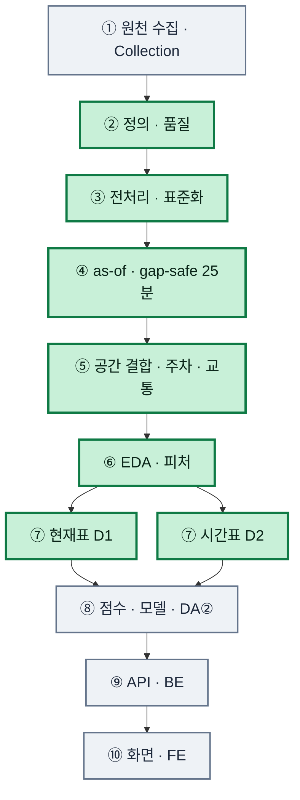
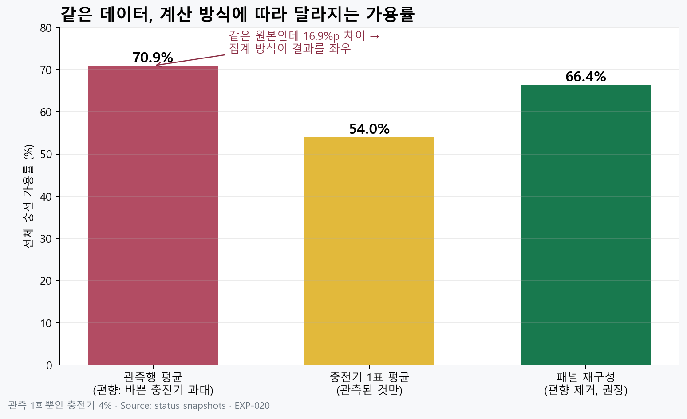
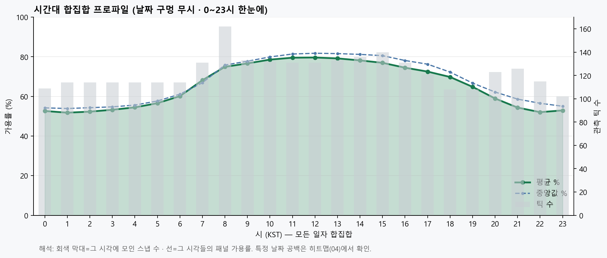
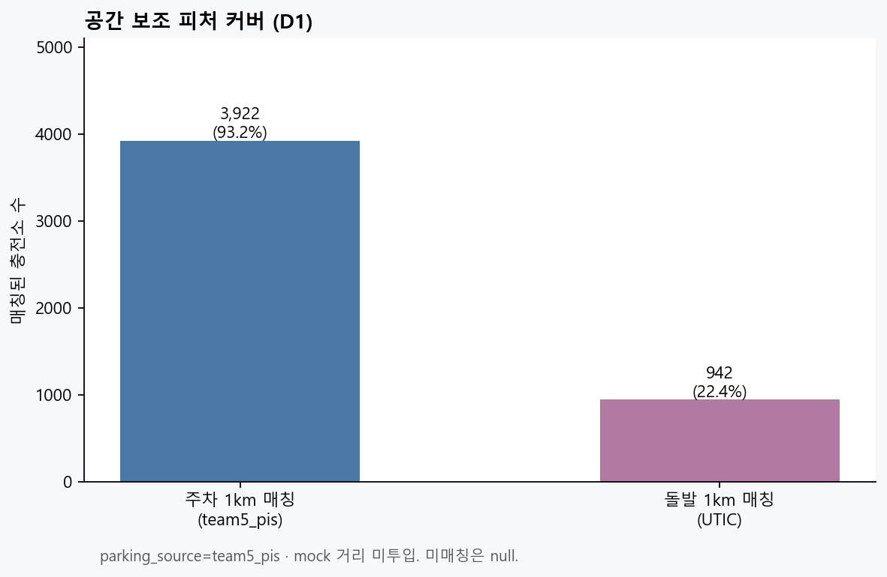

# EV SafeCharge

> **도착했을 때 실제로 충전할 수 있는 충전소를 찾는 추천 서비스**  
> 팀 프로젝트 · 개인 담당: **이현석 / AI·데이터 ① (데이터·파이프라인)**

가까운 충전소가 아니라, 상태·신선도·충전기 수·교통·주차를 묶어 **도착 시 실패 위험이 낮은 후보**를 만들기 위한 **입력 데이터**를 담당했습니다.  
점수·Top-N·화면은 DA②·백엔드·프론트 범위입니다.

| | |
|---|---|
| **상태** | `DA1_READY_FOR_DA2_MODEL_EVALUATION` |
| **기준시각** | `2026-08-09 07:23:21 KST` |
| **검증** | 역할 8/8 — [역할 완료 검증서](./docs/데이터파트_①_역할완료_검증_20260809.md) |

---

## 목차

1. [바로 가기](#바로-가기)
2. [문제와 해결](#문제와-해결)
3. [나의 역할](#나의-역할)
4. [MVP 범위](#mvp-범위)
5. [파이프라인](#데이터-파이프라인)
6. [핵심 결과](#핵심-결과)
7. [신뢰성 설계](#데이터-신뢰성을-높인-핵심-설계)
8. [EDA·집계 인사이트](#eda에서-확인한-패턴)
9. [② 핸드오프 계약](#모델-담당자에게-넘긴-계약)
10. [코드·검증](#핵심-코드와-검증-근거)
11. [실행 방법](#실행-방법)
12. [한계와 다음](#한계와-다음-단계)

---

## 바로 가기

| 보고 싶은 것 | 경로 |
|---|---|
| **작업 코드 모음** | [`apps/data-pipeline/da1_최종코드/`](./apps/data-pipeline/da1_최종코드/) |
| 코드 인덱스 | [`DA1_핵심코드_인덱스.md`](./apps/data-pipeline/DA1_핵심코드_인덱스.md) |
| 스키마 정본 | [`docs/data/스키마/`](./docs/data/스키마/) |
| 팀공유 문서 | [`docs/팀공유/`](./docs/팀공유/) |
| 집계 편향 그림 (70.9 / 54.0 / **66.4**) | [`chart_bias_comparison.png`](./docs/팀공유/상태수집_패널차트_20260809/figures/chart_bias_comparison.png) |
| 타당성 WARN | [`WARN의미_쉽게읽기.md`](./docs/data/analysis/data_validity_assessment_20260809/WARN의미_쉽게읽기.md) |
| 피처 신뢰도 WARN | [`신뢰도WARN_의미_쉽게읽기.md`](./docs/팀공유/피처선정_최종_HGB_도착ETA_20260808/신뢰도WARN_의미_쉽게읽기.md) |
| 팀 에이전트 규칙 | [`AGENTS.md`](./AGENTS.md) |

---

## 문제와 해결

**문제:** 가까운 충전소여도 이동 중 상태 변화, 낡은 API, 충전기 1대·고장, 주차·교통 때문에 실패할 수 있음.

**해결(① 범위):** 거리만이 아니라 아래를 **정의·검증·데이터셋**으로 넘김.

- 사용가능 대수·관측 가용률 (미관측 ≠ 사용불가)
- 상태 갱신·관측 신선도
- 충전기 수·관측 커버리지
- 공용/이용제한
- 주차·소통·돌발 (커버리지 한계는 HOLD)
- 시간대·요일·과거 상태 변화

---

## 나의 역할

| 구분 | 담당 | 대표 결과 |
|---|---|---|
| 정의 | 출처·키·행 단위·기준시각 | 데이터 사전·명세 |
| 품질 | 결측·중복·좌표·상태코드 | FAIL 0 / WARN 문서화 |
| 전처리 | 상태 표준화·최신 레코드 | 재현 가능 정제 |
| 시점 | as-of · **25분 gap-safe** | 미래누수·가짜가용 차단 |
| 공간 | 주차·교통 거리 결합 | 매칭률·미매칭 관리 |
| EDA·피처 | 시간대·신선도·최종 9피처 | 학습·규칙 입력 |
| 데이터셋 | **현재표** · **시간표** | ② 핸드오프 |
| 검증·문서 | 테스트·계약·한계 | 역할 8/8 |

---

## MVP 범위

지금은 **규칙 기반 추천 입력**까지다. 아래는 MVP에 **포함하지 않는다.**

- 예약·리뷰·커뮤니티
- 운영 서빙 ML 성능 자랑 / 점수·Top-N UI (→ **DA②·BE·FE**)
- 주차·UTIC·usage를 본선 점수로 강제 (→ **HOLD·보조**)

팀 공통 가중치·신뢰도 등급은 [`AGENTS.md`](./AGENTS.md)를 따른다.

---

## 데이터 파이프라인



**초록 = AI·데이터 ① 담당.** 수집은 Collection, 점수·추천은 DA②, API·UI는 BE·FE.

---

## 핵심 결과

| 결과 | 규모 | 의미 |
|---|---:|---|
| 충전기 마스터 | 25,368기 | 기본정보 |
| **현재표** | **4,210곳** | 기준시각 충전소 1행 |
| 좌표 정상 | 4,201곳 | 공간결합 가능 |
| **시간표** | **약 9.12M행** | 충전소×관측시점 |
| 관측시점 | 2,960 | 스냅샷 컷 |
| 주차 1km | 3,922곳 · 93.2% | 보조 (realtime은 더 얇음) |
| 돌발 1km | 942곳 · 22.4% | 보조·제한적 |
| 공용 후보 | 1,853곳 | 기본 추천 풀 |

메타: [현재표 HANDOFF](./apps/data-pipeline/evaluation/results/datasets/handoff_to_model/HANDOFF_META.json) · [시간표 HANDOFF](./apps/data-pipeline/evaluation/results/datasets/handoff_to_model/HANDOFF_META_D2.json)

| 데이터셋 | 행 단위 | 용도 |
|---|---|---|
| **현재표** (D1) | 충전소 × 기준시각 | MVP 후보·서비스 조회 |
| **시간표** (D2) | 충전소 × 관측시점 | 변화 분석·학습 |

---

## 데이터 신뢰성을 높인 핵심 설계

1. **미관측 ≠ 사용불가** — 관측분만 가용률 분모  
2. **상태시각 ≠ 관측시각** — `statUpdDt` vs `last_seen_at`  
3. **as-of** — 기준시각 이후 정보 차단 (시간 누수 방지)  
4. **gap-safe** — 공백 **>25분**이면 ffill 중단 ([`gap_safe_panel.py`](./apps/data-pipeline/processing/features/gap_safe_panel.py))  
5. **집계 정의 고정** — 같은 원본도 세는 법에 따라 가용률이 달라짐 → **패널 재구성 채택** (아래)

---

## EDA에서 확인한 패턴

### 집계 방식에 따라 달라지는 가용률 (EXP-020)

동일 status 스냅샷 기준 `bias_summary()` 결과:

| 방식 | 값 | 해석 |
|---|---:|---|
| 관측행 평균 | **70.9%** | 바쁜 충전기 과대 |
| 충전기 1표 | **54.0%** | 관측된 것만 동등 1표 |
| **패널 재구성 (채택)** | **66.4%** | ffill + 25분 공백 절단 |



근거 코드: [`build_panel.py`](./apps/data-pipeline/da1_최종코드/01_현재표_시간표_전처리/build_panel.py) · 실험: [`EXP-020`](./apps/data-pipeline/evaluation/personal/experiments/EXP-020_20260718_status수집_데이터가치_시각평가.md)

### 시간대 패턴

오전이 저녁보다 관측 가용률이 높은 편(패널 기준). 기술통계이며 성공률 예측이 아님.



### 보조 데이터 커버리지

주차 공간매칭은 넓고, 돌발은 22.4%로 얇다 → **전 소 공통 신호로 쓰지 않음**.



---

## 모델 담당자에게 넘긴 계약

- 기본 후보: `recommend_public_default=true`
- 미관측 ≠ 사용불가 · 가용률은 관측 분모
- 주차·교통 미매칭은 mock 채우지 않고 `null`
- 사용자 ETA는 BE·TMAP
- 점수·위험도·Top-N·추천이유·서빙 = **②**

상세: [데이터 사전](./docs/data/스키마/데이터_사전.md) · [상태코드](./docs/data/스키마/상태코드_매핑.md) · [피처](./docs/data/스키마/피처_카탈로그.md) · [데이터셋](./docs/data/스키마/데이터셋_명세.md)

---

## 핵심 코드와 검증 근거

| 영역 | 경로 |
|---|---|
| **볼 코드 (모음)** | [`da1_최종코드/`](./apps/data-pipeline/da1_최종코드/) |
| 패널·bias_summary | [`build_panel.py`](./apps/data-pipeline/da1_최종코드/01_현재표_시간표_전처리/build_panel.py) |
| gap-safe | [`gap_safe_panel.py`](./apps/data-pipeline/processing/features/gap_safe_panel.py) |
| 신뢰도 | [`reliability.py`](./apps/data-pipeline/processing/core/reliability.py) |
| 테스트 | [`evaluation/tests/`](./apps/data-pipeline/evaluation/tests/) · [`test_status_panel.py`](./apps/data-pipeline/evaluation/tests/test_status_panel.py) |
| 핸드오프 샘플 | [`handoff_to_model/`](./apps/data-pipeline/evaluation/results/datasets/handoff_to_model/) |
| 역할 검증 | [검증서](./docs/데이터파트_①_역할완료_검증_20260809.md) |

---

## 실행 방법

Python 3.11+ 권장.

```powershell
python -m venv .venv
.\.venv\Scripts\Activate.ps1
pip install -r apps/data-pipeline/evaluation/requirements.txt
python -m pytest apps/data-pipeline/evaluation/tests -v
```

키는 [`.env.example`](./.env.example) → 로컬 `.env` (커밋 금지).

패널 집계 재현 예:

```powershell
cd apps/data-pipeline/evaluation/personal/experiments/SANDBOX_20260717_status_periodic_collection/src
python -c "from build_panel import bias_summary; import json; print(json.dumps(bias_summary(), ensure_ascii=False, indent=2))"
```

---

## 기술 스택

Python · pandas · Parquet/CSV · pytest · EvCharger / 대구주차 / UTIC / TMAP · GitHub 역할별 핸드오프

## 팀 구성

| 역할 | 영역 |
|---|---|
| FE | 지도·목록 UI |
| BE | REST·DB·외부 API |
| 수집 | 공공 API·적재 |
| **① 이현석** | **정의·품질·전처리·EDA·피처·데이터셋** |
| ② | 점수·위험도·모델·서빙 |

---

## 한계와 다음 단계

- 수치는 2026-08-09 컷. 실시간 운영 상태가 아님
- EDA는 기술통계. 충전 성공률 보장이 아님
- 돌발 커버 22.4% · 주차 realtime은 HOLD
- 학습용 ETA(동대구 고정) ≠ 사용자 실시간 ETA
- 점수·화면은 ① 성과에 넣지 않음

다음: ②가 동일 분할로 거리순·규칙·ML 비교, BE가 사용자 ETA와 연결.
