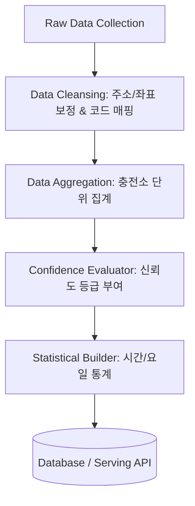

# EV SafeCharge

**도착 시 실제 사용 가능성을 예측하는 전기차 충전소 추천 서비스**

단순히 가장 가까운 충전소를 안내하는 것이 아니라, 사용자가 **도착했을 때 실제로 충전기를 사용할 가능성이 높은 충전소**를 추천합니다. 실시간 충전기 상태, 교통 상황, 상태 갱신 시각, 충전기 수, 주차 정보, 날씨, 주변 편의시설을 종합 분석하여 충전 실패 위험이 낮은 충전소를 우선 추천합니다.

> "지금 가장 가까운 충전소는 어디인가?"가 아니라
> **"내가 실제로 도착했을 때 가장 높은 확률로 충전할 수 있는 충전소는 어디인가?"**

---

## 팀 구성 및 역할 분담 (4인)

| 역할 | 인원 | 담당 영역 | 작업 디렉터리 |
|---|---|---|---|
| 프론트엔드 | 1명 | 지도/목록 UI, 충전소 상세·비교 화면, 필터, 길 안내 연동 | `apps/web/` |
| 백엔드 | 1명 | REST API 서버, 추천 점수·실패 위험도 계산 로직, DB 설계 | `apps/api/`, `packages/recommendation-core/` |
| 데이터 수집 | 1명 | 외부 공공 API 연동·수집 파이프라인, 스케줄링, 원본 적재 | `apps/data-pipeline/collection/` |
| 데이터 가공 | 1명 | 수집 데이터 정제·정규화, 신뢰도 계산, 통계·이용 패턴 집계 | `apps/data-pipeline/processing/` |

각 디렉터리에는 담당자별 상세 가이드(`AGENTS.md`)가 있습니다. 전체 공통 규칙은 루트의 [`AGENTS.md`](./AGENTS.md)를 참고하세요.

### 역할별 상세 업무

**프론트엔드 (1명)**
- 메인 화면: 현재 위치, 충전소 검색, 급속/완속 필터, 최대 이동시간 설정
- 지도 화면: 충전소 마커(충전 가능 상태·실패 위험도별 표시), 추천 충전소 강조
- 목록/상세 화면: 추천 순위, 사용 가능 충전기 수, 상태 갱신 시각, 실패 위험도, 추천 이유
- 충전소 비교 화면(2~3곳): 거리·이동시간·충전기 수·신뢰도·주차료·위험도 비교표
- 주변 편의시설(카페·공원·편의점 등) 추천 UI

**백엔드 (1명)**
- 충전소 검색 API: 위치 기반 후보 수집 + 필터(급속/완속, 충전 규격, 무료주차 등)
- 추천 점수 계산: 충전 가능성 40% + 신뢰도 20% + 이동시간 15% + 대기 위험 15% + 편의성 10%
- 실패 위험도 산출(낮음/보통/높음) 및 추천 이유 문구 생성
- 교통 API 연동으로 실시간 예상 이동시간 계산
- DB 스키마 설계 및 데이터 팀과의 인터페이스 정의

**데이터 수집 (1명)**
- 한국환경공단 EvCharger API: 충전소 정보(`getChargerInfo`) + 실시간 상태(`getChargerStatus`) 주기 수집
- 교통소통정보, 공영주차장, 기상청 날씨, 주변 시설(카카오 로컬 등) API 연동
- 수집 스케줄러 구축(상태 정보는 분 단위, 정적 정보는 일 단위)
- API 장애·호출 한도(일 트래픽 1,000건 등) 대응 전략

**데이터 가공 (1명) - 이현석**
- **원본 데이터 정제**: 좌표·주소 유효 범위 정합성 검증, 상이한 충전기 타입 코드 매핑(`01` ➡️ `DC차데모` 등), 결측값 및 예외 처리
- **충전소 단위 집계**: 개별 충전기 데이터를 충전소 ID 기준으로 그룹화하여 전체/사용 가능/사용 중/고장 통계 집계
- **신뢰도 등급 계산**: 최종 상태 갱신 시각을 비교하여 신뢰도 등급(🟢높음 / 🟡보통 / 🔴확인 필요) 계산
- **이용 패턴 통계**: 시간대(00시~23시) 및 요일별 충전기 사용률을 누적 가공하여 예측 모델 피처 데이터 제공

---

## 활용 데이터 (공공·민간 API)

MVP는 **대구 지역 중심**으로 개발하며, 신청·연동은 3단계로 진행합니다.

**1차 필수 (발급·테스트 완료)** — 이것만으로 주변 충전소 검색, 상태 표시, 예상 이동시간, 비교, 주변 카페 추천까지 가능

| 데이터 | 출처 | 용도 |
|---|---|---|
| 전기차 충전소 정보·상태 | 한국환경공단 EvCharger API | 충전소·충전기 실시간 상태 (핵심 데이터) |
| 자동차 경로 안내 | TMAP Open API | 실시간 교통 반영 이동시간·도착 예상시각 |
| 주변 시설 검색 | 카카오 로컬 API | 충전 중 이용할 카페·음식점·편의점 등 추천 |

**2차 신청**

| 데이터 | 출처 | 용도 |
|---|---|---|
| 날씨 | 기상청 단기예보 API | 악천후 시 보조 가중치 (nx/ny 격자좌표 변환 필요) |
| 교통소통정보 | 대구광역시 교통소통정보(신) | 도로 구간별 속도, 혼잡구간 표시·설명 |
| 돌발 교통정보 | 대구광역시 돌발 교통정보(신) | 사고·공사·행사·통제 반영 감점 및 경고 |
| 주차장 기본정보 | 대구 통합주차정보시스템(pis.daegu.go.kr) | 주차요금·운영시간·주차면 수 (별도 키 발급) |
| 실시간 주차 혼잡도 | 대구 통합주차정보시스템 | 잔여 주차면 기반 진입 실패 위험 감점 |

**3차 확장**

| 데이터 | 출처 | 용도 |
|---|---|---|
| 관광지·문화시설 | 한국관광공사 TourAPI (KorService2) | 충전 중 방문할 관광지 추천 |
| 공원·산책로 | 대구광역시 산책로정보 API | 충전 시간대별 산책로·공원 추천 |

신청 주소와 세부 연동 방법은 `apps/data-pipeline/AGENTS.md`를 참고하세요. 인증키는 모두 `.env`로 관리하며(커밋 금지, `.env.example` 참고), API 테스트 스크립트는 `scripts/api-tests/` 폴더에 있습니다.

## MVP 범위 (1차 목표)

1. 현재 위치 기반 주변 충전소 검색 (지도 + 목록)
2. 실시간 충전기 상태 및 상태 갱신 시각 표시
3. 교통 상황 반영 예상 이동시간
4. 추천 점수 계산 및 충전 실패 위험도(낮음/보통/높음) 표시
5. 충전소 2~3곳 비교 기능
6. 주변 카페·공원·편의시설 추천

시간대별 혼잡도 예측, 예약, 리뷰, AI 예측 모델 등은 **추후 확장 기능**입니다.

## 프로젝트 구조

```
ev-safecharge/
├── apps/
│   ├── web/                    # [프론트엔드] Next.js 웹 앱
│   │   ├── src/
│   │   │   ├── app/            # 라우팅·페이지
│   │   │   ├── components/     # 공용 UI 컴포넌트
│   │   │   ├── features/       # map / stations / comparison / nearby-places
│   │   │   ├── services/       # 백엔드 API 호출 계층
│   │   │   ├── types/
│   │   │   └── utils/
│   │   ├── public/
│   │   └── AGENTS.md
│   ├── api/                    # [백엔드] Express API 서버
│   │   ├── src/
│   │   │   ├── routes/ controllers/ repositories/ models/ dto/ config/ utils/
│   │   │   └── services/       # charging-station / traffic / weather / parking / places / recommendation
│   │   ├── tests/
│   │   └── AGENTS.md
│   └── data-pipeline/          # [데이터 수집·가공] 공공 API 파이프라인
│       ├── collection/         # 수집 (원본 적재, 스케줄링)
│       ├── processing/         # 가공 (정제·집계·신뢰도 계산)
│       └── AGENTS.md
├── packages/
│   ├── shared-types/           # 프론트·백엔드 공통 타입
│   └── recommendation-core/    # 추천 점수 계산 로직 (가중치·신뢰도 등급)
├── docs/                       # 요구사항·구성도·API 명세·ERD·회의록·트러블슈팅
├── infra/                      # docker / deployment
├── scripts/
│   └── api-tests/              # 외부 API 검증 스크립트 (test-all-apis.ps1 등)
├── .github/                    # 이슈·PR 템플릿, CI, CODEOWNERS
├── AGENTS.md                   # 팀 공통 에이전트 가이드 (도메인 규칙)
├── CONTRIBUTING.md             # 브랜치·커밋·PR 규칙
├── docker-compose.yml          # 로컬 개발용 PostgreSQL(PostGIS)
├── .env                        # API 인증키 (커밋 금지, .env.example 참고)
└── README.md                   # 이 문서
```

## 기술 스택

- 프론트엔드: **Next.js** (TypeScript)
- 백엔드: **Express** (Node.js)
- 외부 API 키는 전부 Express 백엔드 환경변수에만 두고, 브라우저(Next.js 클라이언트) 코드에서는 외부 API를 직접 호출하지 않습니다. (키 노출 시 타인이 호출량을 소진할 수 있음)

```
Next.js → (우리 백엔드 API 호출) → Express → (키 사용) → 공공·민간 API
```

## 시작하기

```bash
# 1. 로컬 DB 실행 (PostgreSQL + PostGIS)
docker compose up -d

# 2. 환경변수 준비 — .env.example을 복사해 키 입력
#    (루트, apps/api, apps/web 각각)

# 3. 외부 API 상태 확인 (PowerShell)
cd scripts/api-tests
./test-all-apis.ps1
```

## 팀 협업 규칙

상세 규칙은 [`CONTRIBUTING.md`](./CONTRIBUTING.md) 참고. 요약:

- 브랜치: `main`(배포) ← `dev`(통합) ← `feat/<영역>-<기능>` (예: `feat/web-map-view`)
- 커밋 메시지: `[영역] 내용` (예: `[api] 추천 점수 계산 라우트 추가`)
- 영역 간 인터페이스(API 명세, DB 스키마, 공용 타입)는 변경 전 반드시 관련 담당자와 합의
- `.env`, 인증키, 수집된 원본 대용량 데이터는 커밋하지 않기

---

## 🗂️ 데이터 가공 파이프라인 흐름



---

## 📊 산출물 데이터 스키마 (예시)

### 가공 후 충전소 요약 데이터 (JSON)
```json
{
  "station_id": "ST-10293",
  "station_name": "대구시청 동인청사 주차장",
  "address": "대구광역시 중구 공평로 88",
  "coordinate": {
    "latitude": 35.8714,
    "longitude": 128.6014
  },
  "summary": {
    "total_chargers": 5,
    "available_chargers": 2,
    "charging_chargers": 2,
    "broken_chargers": 1
  },
  "confidence_level": "High",
  "last_update_time": "2026-07-15T17:05:00+09:00"
}
```

---

## ⚠️ 예외 및 충돌 상황 대응 가이드 (최악의 시나리오)

실시간 데이터 파이프라인 운영 중 발생할 수 있는 데이터 정합성 충돌 및 시스템 장애의 최악의 경우를 정의하고, 이에 대응하는 예외 처리 방안을 설계합니다.

### 1. 동일 ID 데이터 정합성/상태 충돌 (Data Conflict)
* **상황**: 서로 다른 수집 소스나 비동기 이벤트 큐에서 동일한 충전소 ID(`station_id`)에 대해 서로 모순되는 상태 데이터(예: 서로 다른 잔여 충전기 수)가 거의 동시에 들어올 때.
* **대응책 (LWW - Last-Write-Wins)**:
  * 원본 API 응답에 포함된 최종 갱신 타임스탬프(`statUpdDt` 등)를 기준으로 가장 최신의 데이터만 수용하고, 과거 타임스탬프를 가진 데이터는 폐기합니다.
  * 타임스탬프가 동일할 경우 데이터의 무결성을 보장하기 위해 데이터베이스의 `UPSERT` 구문을 활용하여 기존 레코드를 강제 업데이트합니다.

### 2. 동시 쓰기 잠금 충돌 (Concurrency / Write Lock Conflict)
* **상황**: 통계 집계 배치(Batch) 작업과 실시간 상태 반영 스트림(Stream) 작업이 동일한 데이터베이스 테이블의 행(Row)에 동시에 쓰기(Write)를 시도하여 교착 상태(Deadlock) 또는 잠금 대기 초과(Lock Timeout) 에러가 발생할 때.
* **대응책**:
  * **낙관적 잠금 (Optimistic Locking)**: 버전 번호(`version`) 컬럼을 도입하여 데이터를 업데이트할 때 버전 정합성을 체크하고, 충돌 발생 시 롤백 후 재시도하게 합니다.
  * **지수 백오프 재시도 (Exponential Backoff Retry)**: 데이터베이스 잠금 예외가 발생할 경우 즉시 실패 처리하지 않고, `100ms ➡️ 200ms ➡️ 400ms` 등의 지수 대기 시간을 두어 최대 3회 재시도(Retry Queue)하는 구조를 구축합니다.

### 3. 외부 API 스키마 변경 및 데이터 충돌 (Schema Mismatch)
* **상황**: 공공데이터 API 제공처 측에서 예고 없이 응답 데이터 필드명을 변경하거나 데이터 타입(예: String 타입의 숫자가 Integer로 변경 등)을 변경하여 파싱 에러(Parsing Error)가 발생할 때.
* **대응책**:
  * **스키마 검증 및 Fallback**: 파이프라인 입구에 유효성 검증(Pydantic, Joi 등) 레이어를 배치하여 스키마가 충돌하면 에러가 전파되는 것을 차단합니다.
  * **알림 및 수동 복구**: 비정상 스키마 검출 시 장애 발생 로그와 즉각적인 모니터링 알림(Slack Webhook)을 전송하며, 스키마 수정 전까지는 최근 10분간의 정상 데이터 캐시를 사용자에게 서빙하는 Fallback 모드를 작동시킵니다.

### 4. 🔀 Git / GitHub 협업 시 병합 충돌 (Merge Conflict)
* **상황**: 팀 프로젝트에서 여러 개발자가 동일한 파일의 같은 영역을 동시에 수정하고 각각 원격 저장소(`main` 등)에 병합(Merge) 또는 Pull Request를 시도하여 코드 충돌이 일어났을 때.
* **예방 및 해결 프로토콜**:
  * **사전 예방**:
    1. 작업 시작 전 반드시 `main` 브랜치의 최신 이력을 로컬로 가져옵니다: `git checkout main && git pull origin main`
    2. 피처 브랜치(`feature/이현석`)로 돌아가 `main` 브랜치를 머지하여 로컬에서 미리 충돌을 예방합니다: `git merge main`
  * **충돌 발생 시 해결**:
    1. 충돌 파일 확인 후 충돌 마커(`<<<<<<< HEAD`, `=======`, `>>>>>>>`)를 확인합니다.
    2. 동료 개발자와 상의하여 반영해야 할 올바른 코드를 조율 및 병합합니다.
    3. 충돌 마커를 모두 제거한 후, 파이프라인 테스트 및 빌드를 실행하여 정상 작동 여부를 검증합니다.
    4. 검증이 완료되면 스테이징 및 병합 완료 커밋을 작성하여 푸시합니다:
       ```bash
       git add .
       git commit -m "conflicts: 병합 충돌 해결 및 코드 정합성 복구"
       git push origin feature/이현석
       ```

### 5. 🛡️ 외부 데이터 파일 안전하게 가져오기 (Safe Data File Ingestion Protocol)
* **상황**: 외부 API(공공데이터 등)나 동료 개발자로부터 충전소 실시간 데이터 파일(CSV, JSON 등)을 내 로컬 환경 또는 가공 파이프라인으로 가져올 때, 파일 전송 중단, 기존 파일 덮어쓰기 유실, 혹은 불완전한 스키마 유입으로 인한 파이프라인 작동 불능을 방지해야 할 때.
* **안전한 데이터 파일 반영 가이드**:
  1. **임시 디렉토리(Staging Area)를 통한 원자적 교체(Atomic Rename)**:
     * 가공 파이프라인이 즉시 읽어들이는 활성(Active) 경로(예: `/data/active/`)에 직접 다운로드하지 않습니다.
     * `/data/temp/` 같은 임시 공간에 다운로드를 완전히 완료한 후, 검증을 통과하면 `mv` (이름 변경) 명령어를 통해 원자적(Atomic)으로 기존 파일을 대체합니다.
     ```bash
     # 위험한 방법: 즉시 다운로드하여 덮어쓰기 (네트워크 실패 시 불완전한 데이터가 적재됨)
     curl -o /data/active/stations.json http://api.data.go.kr/stations
     
     # 안전한 방법: 임시 다운로드 후 검증 및 교체
     curl -o /data/temp/stations_incoming.json http://api.data.go.kr/stations
     # (검증 단계 통과 후)
     mv /data/temp/stations_incoming.json /data/active/stations.json
     ```
  2. **파일 무결성 및 체크섬(Checksum) 검증**:
     * 파일 전송 시 유실이나 깨짐이 없는지 검증하기 위해 전송처와 해시값(MD5 등)을 비교하거나, 파일의 포맷 유효성을 가공 전에 반드시 검사합니다.
     * **JSON**: 파싱(Parse) 시 문법 에러가 발생하는지 `try-except` 구문으로 확인합니다.
     * **CSV**: 헤더(Header) 개수와 각 행의 컬럼 수가 일치하는지 체크합니다.
  3. **스키마 및 필수 값 정합성 검사 (Dry-Run)**:
     * 데이터 파일을 로드하여 정식 가공하기 전에 핵심 필수 필드(`station_id`, `coordinate` 등)가 존재하고 데이터 타입이 맞는지 라이브러리(Pydantic, Great Expectations 등)나 검증 스크립트로 1차 검증(Dry-run)합니다.
  4. **날짜/시간 기반 버전 관리 및 백업**:
     * 동일한 이름의 파일(`data.json`)로 계속 덮어쓰면 과거 이력 추적이 불가능하고 복구가 어렵습니다.
     * 파일명 뒤에 타임스탬프를 부여하여 저장하고(예: `stations_20260715_1730.json`), 활성 경로에는 가장 최신 파일에 연결된 심볼릭 링크(Symbolic Link)를 사용하는 것이 안전합니다.
     ```bash
     # 날짜별로 구분하여 백업 보존
     cp /data/temp/stations_incoming.json /data/archive/stations_$(date +%Y%m%d_%H%M%S).json
     ```
