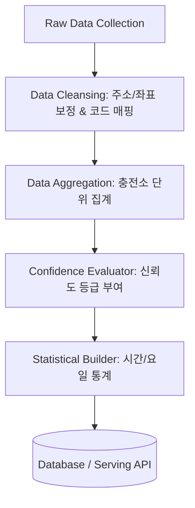

# 전기차 충전소 실시간 데이터 파이프라인 - 데이터 가공 (Data Processing)

이 프로젝트는 대구광역시 실시간 전기차 충전소 데이터를 기반으로, 수집된 원본 데이터를 정제 및 집계하여 신뢰할 수 있는 데이터 서비스를 제공하는 파이프라인입니다. 

본 파트는 수집 레이어(Collection)와 서빙 레이어(API/Web)의 교두보 역할을 하며, 원본 데이터 가공 및 정합성 검증을 전담합니다.

---

## 🛠️ 담당 역할 및 핵심 업무

### 1. 원본 데이터 정제 (Data Cleansing)
* **좌표·주소 정합성 검증**:
  * 수집된 충전소의 위도(Latitude)와 경도(Longitude) 값이 대구광역시 행정 구역 및 유효 범위 내에 있는지 정합성을 검증합니다.
  * 누락되거나 비정상적인 지번 주소/도로명 주소를 카카오/네이버 로컬 API 역지오코딩 등을 활용하여 보정합니다.
* **충전기 타입 코드 매핑**:
  * 공공데이터 API 등에서 전달하는 기관별 상이한 충전기 타입 코드(예: `01`, `02` 등)를 표준 공통 코드 테이블과 매핑하여 일관된 정보로 변환합니다.
    * *예: `01` ➡️ `DC차데모`, `02` ➡️ `AC완속`, `03` ➡️ `DC콤보`*
* **결측치 및 예외 처리**:
  * 충전기 ID가 누락되었거나 상태 값(`stat`)이 알 수 없음으로 들어오는 경우에 대한 결측값 대체 및 필터링 정책을 적용합니다.

### 2. 충전소 단위 집계 (Station Aggregation)
* 개별 충전기(Charger) 단위로 수집되는 로우(Raw) 데이터를 충전소(Station) ID 기준으로 그룹화(Group-by)하여 실시간 모니터링용 통계를 산출합니다.
* **집계 지표**:
  * `total_chargers` (전체 충전기 수)
  * `available_chargers` (즉시 사용 가능한 충전기 수 - 대기 상태)
  * `charging_chargers` (현재 충전 중인 충전기 수)
  * `broken_chargers` (점검 중이거나 고장 상태인 충전기 수)

### 3. 상태 갱신 시각 기반 신뢰도 등급 계산 (Confidence Level)
* 오픈 API 데이터의 특성상 실제 현장 상태와 DB 반영 시각 간에 차이가 발생할 수 있습니다. 
* 충전기의 최종 상태 변경 시각(`statUpdDt`)과 현재 가공 시각을 비교하여 신뢰도 등급을 동적으로 계산합니다.
  * 🟢 **높음 (High)**: 마지막 갱신이 **5분 이내**인 경우 (실시간성 우수)
  * 🟡 **보통 (Medium)**: 마지막 갱신이 **5분 초과 ~ 15분 이내**인 경우
  * 🔴 **확인 필요 (Low)**: 마지막 갱신이 **15분 초과**인 경우 (현장 상태와 다를 확률 존재)

### 4. 시간대·요일별 이용 패턴 통계 (Pattern Analytics)
* **이전 혼잡 기록 분석**:
  * 수집 및 가공 주기에 맞춰 각 충전소별 시간대(00시~23시) 및 요일(월~일) 단위의 충전기 사용률(`charging_chargers / total_chargers`)을 누적 통계 데이터로 가공합니다.
* **기반 데이터 제공**:
  * 가공된 통계 데이터는 시계열 데이터 모델 또는 추후 확장될 AI 기반 충전 혼잡도 예측 모델의 학습용 피처 데이터(Feature Data)로 안전하게 적재됩니다.

---

## 🗂️ 데이터 가공 파이프라인 흐름



---

## 📊 산출물 데이터 스키마 (예시)

### 가공 후 충전소 요약 데이터 (JSON)
```json
{
  "station_id": "ST-10293",
  "station_name": "대구시청 동인청사 주차장",
  "address": "대구광역시 중구 공평로 88",
  "coordinate": {
    "latitude": 35.8714,
    "longitude": 128.6014
  },
  "summary": {
    "total_chargers": 5,
    "available_chargers": 2,
    "charging_chargers": 2,
    "broken_chargers": 1
  },
  "confidence_level": "High",
  "last_update_time": "2026-07-15T17:05:00+09:00"
}
```

---

## ⚠️ 예외 및 충돌 상황 대응 가이드 (최악의 시나리오)

실시간 데이터 파이프라인 운영 중 발생할 수 있는 데이터 정합성 충돌 및 시스템 장애의 최악의 경우를 정의하고, 이에 대응하는 예외 처리 방안을 설계합니다.

### 1. 동일 ID 데이터 정합성/상태 충돌 (Data Conflict)
* **상황**: 서로 다른 수집 소스나 비동기 이벤트 큐에서 동일한 충전소 ID(`station_id`)에 대해 서로 모순되는 상태 데이터(예: 서로 다른 잔여 충전기 수)가 거의 동시에 들어올 때.
* **대응책 (LWW - Last-Write-Wins)**:
  * 원본 API 응답에 포함된 최종 갱신 타임스탬프(`statUpdDt` 등)를 기준으로 가장 최신의 데이터만 수용하고, 과거 타임스탬프를 가진 데이터는 폐기합니다.
  * 타임스탬프가 동일할 경우 데이터의 무결성을 보장하기 위해 데이터베이스의 `UPSERT` 구문을 활용하여 기존 레코드를 강제 업데이트합니다.

### 2. 동시 쓰기 잠금 충돌 (Concurrency / Write Lock Conflict)
* **상황**: 통계 집계 배치(Batch) 작업과 실시간 상태 반영 스트림(Stream) 작업이 동일한 데이터베이스 테이블의 행(Row)에 동시에 쓰기(Write)를 시도하여 교착 상태(Deadlock) 또는 잠금 대기 초과(Lock Timeout) 에러가 발생할 때.
* **대응책**:
  * **낙관적 잠금 (Optimistic Locking)**: 버전 번호(`version`) 컬럼을 도입하여 데이터를 업데이트할 때 버전 정합성을 체크하고, 충돌 발생 시 롤백 후 재시도하게 합니다.
  * **지수 백오프 재시도 (Exponential Backoff Retry)**: 데이터베이스 잠금 예외가 발생할 경우 즉시 실패 처리하지 않고, `100ms ➡️ 200ms ➡️ 400ms` 등의 지수 대기 시간을 두어 최대 3회 재시도(Retry Queue)하는 구조를 구축합니다.

### 3. 외부 API 스키마 변경 및 데이터 충돌 (Schema Mismatch)
* **상황**: 공공데이터 API 제공처 측에서 예고 없이 응답 데이터 필드명을 변경하거나 데이터 타입(예: String 타입의 숫자가 Integer로 변경 등)을 변경하여 파싱 에러(Parsing Error)가 발생할 때.
* **대응책**:
  * **스키마 검증 및 Fallback**: 파이프라인 입구에 유효성 검증(Pydantic, Joi 등) 레이어를 배치하여 스키마가 충돌하면 에러가 전파되는 것을 차단합니다.
  * **알림 및 수동 복구**: 비정상 스키마 검출 시 장애 발생 로그와 즉각적인 모니터링 알림(Slack Webhook)을 전송하며, 스키마 수정 전까지는 최근 10분간의 정상 데이터 캐시를 사용자에게 서빙하는 Fallback 모드를 작동시킵니다.

### 4. 🔀 Git / GitHub 협업 시 병합 충돌 (Merge Conflict)
* **상황**: 팀 프로젝트에서 여러 개발자가 동일한 파일의 같은 영역을 동시에 수정하고 각각 원격 저장소(`main` 등)에 병합(Merge) 또는 Pull Request를 시도하여 코드 충돌이 일어났을 때.
* **예방 및 해결 프로토콜**:
  * **사전 예방**:
    1. 작업 시작 전 반드시 `main` 브랜치의 최신 이력을 로컬로 가져옵니다: `git checkout main && git pull origin main`
    2. 피처 브랜치(`feature/이현석`)로 돌아가 `main` 브랜치를 머지하여 로컬에서 미리 충돌을 예방합니다: `git merge main`
  * **충돌 발생 시 해결**:
    1. 충돌 파일 확인 후 충돌 마커(`<<<<<<< HEAD`, `=======`, `>>>>>>>`)를 확인합니다.
    2. 동료 개발자와 상의하여 반영해야 할 올바른 코드를 조율 및 병합합니다.
    3. 충돌 마커를 모두 제거한 후, 파이프라인 테스트 및 빌드를 실행하여 정상 작동 여부를 검증합니다.
    4. 검증이 완료되면 스테이징 및 병합 완료 커밋을 작성하여 푸시합니다:
       ```bash
       git add .
       git commit -m "conflicts: 병합 충돌 해결 및 코드 정합성 복구"
       git push origin feature/이현석
       ```