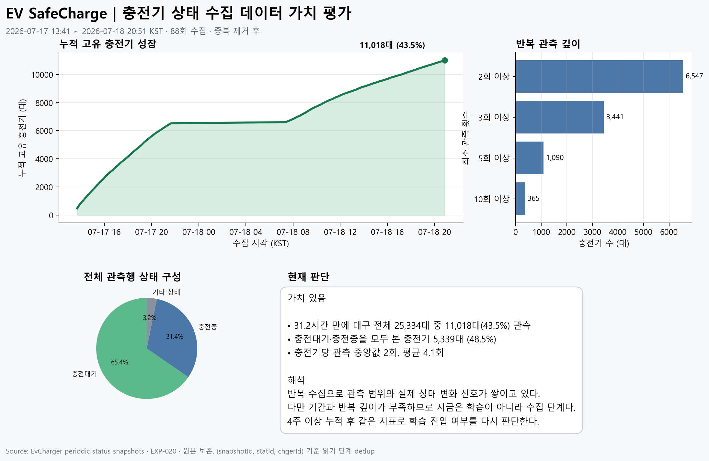
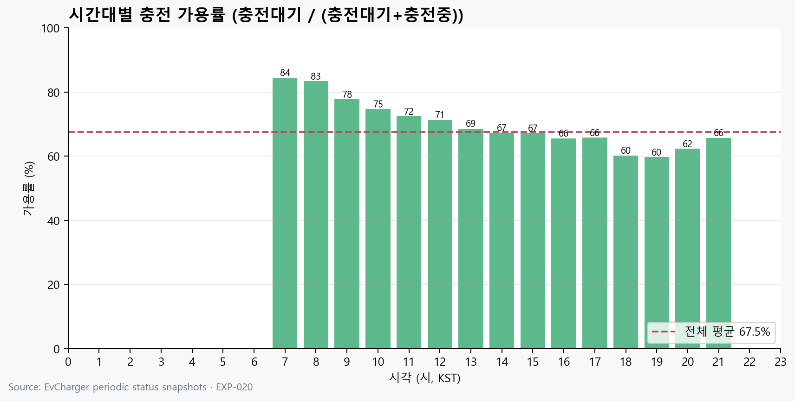
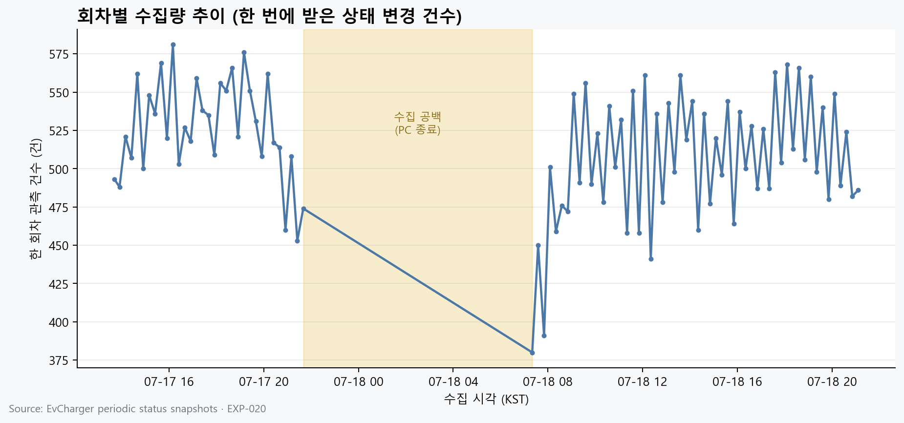
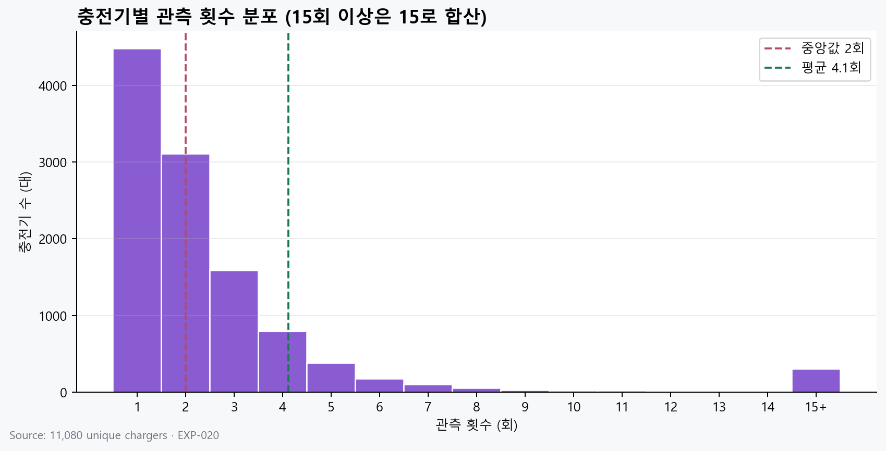
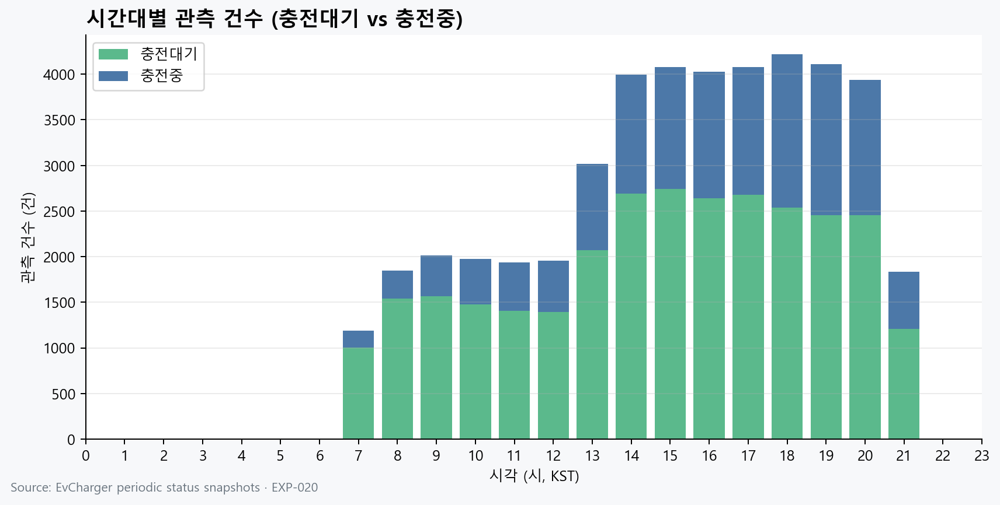
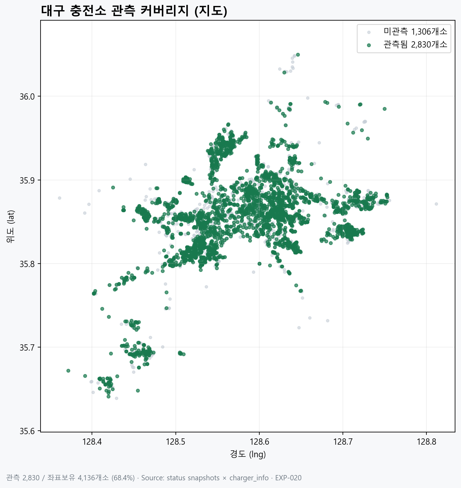
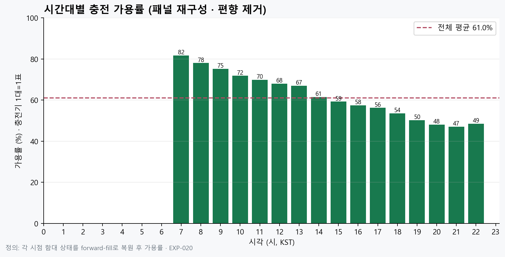
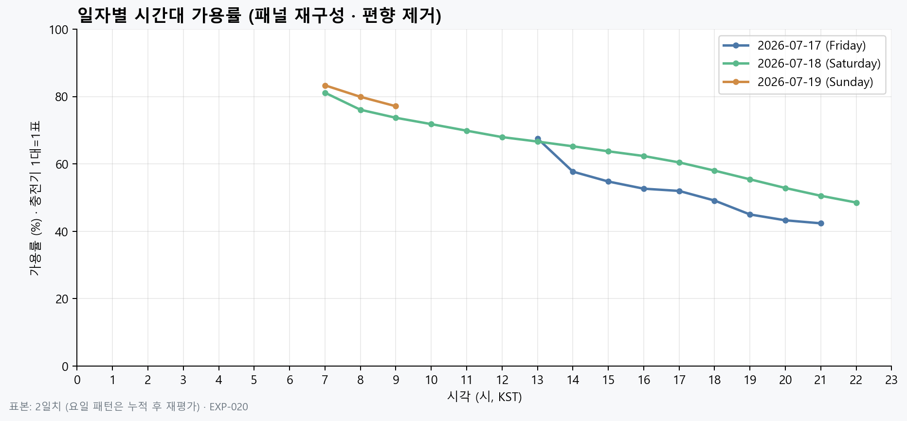
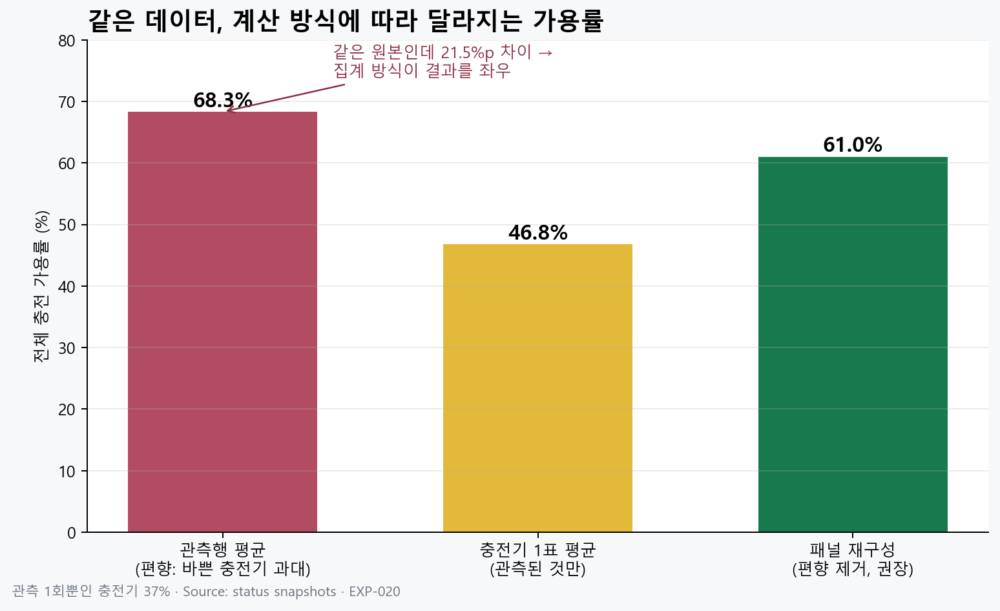
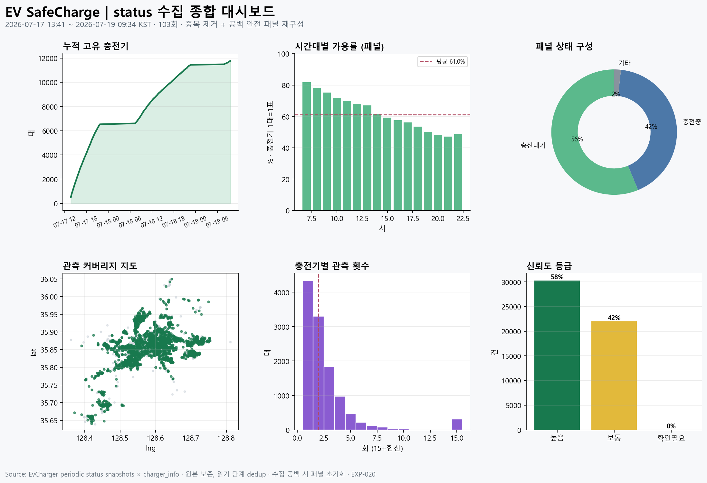

# EXP-020 | status 수집 데이터 가치 시각 평가

| 항목 | 내용 |
|---|---|
| **프로젝트** | EV SafeCharge |
| **실험 ID** | EXP-020 |
| **대응** | EXP-012 주기 수집 · EXP-019 품질 검증 후속 |
| **평가 시점** | 2026-07-18 20:51 KST |
| **관측 기간** | 2026-07-17 13:41 ~ 2026-07-18 20:51 (31.2시간) |
| **상태** | 데이터 가치 있음 · 수집 지속 · 학습은 보류 |

---

## 1. 질문

15분 간격으로 상태 변경분을 모으는 현재 루프가 실제로 가치 있는 데이터를
만들고 있는지 확인한다.

판단 기준은 다음 세 가지다.

1. 반복 수집으로 대구 충전기 관측 범위가 넓어지는가?
2. 같은 충전기의 반복 관측과 실제 상태 변화가 쌓이는가?
3. 지금 바로 AI 학습에 들어갈 만큼 기간과 관측 깊이가 충분한가?

---

## 2. 분석 기준

- 원본: `SANDBOX_20260717_status_periodic_collection/data/snapshots/`
- 로더: `SANDBOX_20260717_status_periodic_collection/src/load_snapshots.py`
- 중복 제거 키: `(snapshotId, statId, chgerId)`
- 대구 전체 충전기: info 기준 25,334대
- 분석 대상: 스냅샷 88회, 중복 제거 관측행 45,204건

원본 스냅샷은 수정하지 않고 읽기 단계에서만 중복을 제거했다.
수집은 계속 진행 중이라 스냅샷/행 수는 시간이 지나며 늘어난다(값 평가 시점 기준 수치).

---

## 3. 시각자료와 상세 설명

모든 차트는 원본 스냅샷을 읽기 단계에서 중복 제거한 뒤 생성했다.
생성 스크립트는 아래 3개다.

```bash
# 요약 대시보드
python .../src/plot_data_value.py
# 기본 차트 4종 (관측행 기반)
python .../src/plot_extra_charts.py
# 고급 차트 4종 (지도·신뢰도·일자비교·종합)
python .../src/plot_advanced_charts.py
# 편향 제거 차트 3종 (패널 재구성)
python .../src/plot_corrected_charts.py
```

### 3.1 데이터 가치 요약 대시보드



- **무엇을 보나**: 누적 관측 성장, 반복 관측 깊이, 상태 구성, 핵심 판단을 한 장에 요약.
- **읽는 법**: 왼쪽 위 곡선이 우상향하면 수집이 범위를 넓히고 있다는 뜻.
- **주의**: "누적 고유 충전기"는 한 번이라도 관측한 수(도달 범위)이지, 그 전부를 깊게 안다는 뜻이 아니다.

### 3.2 누적 고유 충전기 성장

- **정의**: 회차가 지날수록 처음 보는 충전기가 누적으로 몇 대가 되는지.
- **의미**: 한 회차엔 평균 약 514대만 오지만 누적은 계속 증가 → 부분 응답을 시간으로 보완하는 설계가 작동.
- **한계**: 누적값은 줄지 않으므로 "현재 동시 커버리지"가 아니라 "지금까지의 도달 범위".

### 3.3 시간대별 충전 가용률 (관측행 기반 — 편향 있음)



- **정의**: 각 시각에 들어온 관측행에서 `충전대기 / (충전대기+충전중)` 비율.
- **주의(중요)**: 이 방식은 자주 상태가 바뀌는 바쁜 충전기가 과대 반영된다(§4 편향 참고). 값이 실제보다 높게 나온다.
- **올바른 대체**: §3.8의 패널 재구성 버전을 사용한다.

### 3.4 회차별 수집량 추이



- **정의**: 회차마다 받은 상태 변경 건수.
- **의미**: 450~580건으로 안정적. 노란 구간은 PC 종료로 인한 야간 수집 공백.
- **활용**: 공백 구간을 관리 지표(연속성)로 추적.

### 3.5 충전기별 관측 횟수 분포



- **정의**: 같은 충전기를 몇 번 관측했는지의 분포(15회 이상은 15로 합산).
- **의미**: 중앙값 2회로 왼쪽에 몰림 → 시계열이 아직 얕다. 오른쪽 15+는 자주 바뀌는 인기 충전기.
- **목표**: 수집이 길어질수록 분포가 오른쪽으로 이동해야 한다.

### 3.6 시간대별 관측 건수 (대기 vs 충전중)



- **정의**: 시간대별 관측 건수를 대기/충전중으로 나눈 누적 막대.
- **의미**: 낮~저녁에 상태 변화(=관측량)가 많고, 오후로 갈수록 충전중 비중 증가.
- **주의**: 이것도 관측행 기반이라 절대 건수는 바쁜 충전기 영향이 있다. 비율 해석은 패널 기준으로.

### 3.7 관측 커버리지 지도



- **정의**: 좌표 보유 충전소를 관측/미관측으로 표시(대구 영역 필터).
- **의미**: 좌표 보유분의 68.4%를 관측. 도심 밀집, 외곽에 미관측 잔존.
- **한계**: 좌표 없는 충전소(info의 lat/lng 결측)는 지도에서 제외.

### 3.8 시간대별 충전 가용률 (패널 재구성 — 편향 제거, 권장)



- **정의**: 연속 수집 구간 안에서 각 충전기의 마지막 상태를 forward-fill로 복원한 뒤, 충전기 1대=1표로 계산한 가용률. 25분 초과 공백 뒤에는 패널을 초기화한다.
- **의미**: 편향을 제거한 값. 관측행 방식과 달리 특정 시간대(낮) 가용률이 더 정확히 드러난다.
- **근거 모듈**: `src/build_panel.py`.

### 3.9 일자별 가용률 비교 (패널 재구성)



- **정의**: 패널 기반 가용률을 일자별로 나눠 비교.
- **의미**: 금·토 곡선이 비슷. 다만 2일치라 요일 결론은 이르며 누적 후 재평가 대상.

### 3.10 집계 방식 비교 (편향의 크기)



- **정의**: 같은 원본을 세 방식으로 계산한 전체 가용률.
- **의미**: 2026-07-19 09:34 재산출 기준 관측행 평균 68.3%, 충전기 1표 46.8%, 공백 안전 패널 61.0%다. 같은 원본도 집계 방식에 따라 최대 21.5%p 차이가 난다.

### 3.11 종합 대시보드



- **무엇을 보나**: 성장·시간대 가용률·상태구성·지도·관측횟수·신뢰도 6칸 요약. 팀 공유용.
- **집계 기준**: 시간대 가용률과 상태 구성은 충전기 1대=1표인 패널 재구성 기준이다. 25분을 넘는 수집 공백 뒤에는 이전 상태를 넘겨 쓰지 않고 패널을 새로 시작한다.

### 3.12 Cursor Canvas (인터랙티브)

`C:\Users\PC\.cursor\projects\c-Users-PC-Desktop-electronic-aimodel\canvases\status-data-value.canvas.tsx`

---

## 3-A. 집계 방법론과 편향 주의 (중요)

### 왜 편향이 생기나

수집기는 API `period` 파라미터로 **"최근 상태가 바뀐 충전기만"** 받는다.
따라서 자주 바뀌는 바쁜 충전기는 여러 번, 조용한 충전기는 드물게 잡힌다.
관측행을 그대로 평균 내면 바쁜 충전기의 목소리가 커진다(관측 상위 10%가 전체 행의 59.0%).

### 편향의 크기 (같은 원본, 다른 계산)

| 방식 | 전체 가용률 | 설명 |
|---|---|---|
| 관측행 평균 | 68.3% | 바쁜 충전기 과대 반영 (편향) |
| 충전기 1표 평균 | 46.8% | 관측된 충전기만, 관측 빈도 무시 |
| **공백 안전 패널 재구성** | **61.0%** | **연속 구간 안에서 forward-fill 후 시점별 함대 상태로 계산 (권장)** |

- 관측 1회뿐인 충전기가 전체의 37.4%.
- 관측 횟수와 가용률 상관 0.192 → 관측 빈도가 상태와 무관하지 않음(편향 확인).
- 위 수치는 수집이 계속 진행되므로 평가 시점마다 달라진다. 기준 시각은 2026-07-19 09:34 KST다.

### 해결: 패널 재구성 (forward-fill)

1. 연속 수집 구간 안에서 충전기별 마지막 관측 상태를 다음 관측까지 유지시킨다.
   ("응답에 없음 = 상태 변화 없음 = 직전 상태 유지"라는 period 수집의 실제 의미)
2. 25분을 넘는 수집 공백이 생기면 이전 상태를 폐기하고 새 패널을 시작한다.
   (공백 중 발생한 상태 변화는 API의 최근 20분 응답만으로 복구할 수 없음)
3. 각 시점마다 현재 연속 구간에서 알려진 충전기의 상태 표를 복원한다.
4. 충전기 1대=1표로 가용률·통계를 계산한다.

구현: `src/build_panel.py`
- `build_state_panel()` — 시점×충전기 상태 패널(ffill)
- `availability_timeseries()` — 시점별 함대 가용률
- `bias_summary()` — 세 방식 비교

### 원칙

- **도달 범위(누적 고유 수)**는 관측 기반으로 세도 된다.
- **현황 통계(가용률 등)**는 반드시 패널 재구성으로 계산한다.
- 관측행 평균 수치를 대외적으로 "가용률"이라 말하지 않는다.

---

## 4. 결과

### 4.1 관측 범위

- 첫 회차: 493대
- 현재 누적: 11,018대
- 대구 전체 대비: 43.5%
- 한 회차 평균 관측: 약 514대

한 번에 일부만 받지만 반복 수집으로 누적 관측 범위가 계속 증가했다.
따라서 현재 루프는 부분 응답을 시간에 따라 보완하는 목적에 맞게 작동한다.

### 4.2 반복 관측

- 충전기당 평균 4.1회
- 충전기당 중앙값 2회
- 2회 이상: 6,547대
- 3회 이상: 3,441대
- 5회 이상: 1,090대
- 10회 이상: 365대

시계열의 시작점은 생겼지만 관측 깊이는 아직 얕다. 특히 시간대·요일별 패턴을
학습하려면 같은 충전기의 반복 관측이 더 필요하다.

### 4.3 상태 변화 신호

- 충전대기와 충전중을 모두 관측한 충전기: 5,339대
- 전체 관측 충전기의 48.5%

mock이 아닌 실제 상태 변화가 이미 다수 포착됐다. 이는 향후
`available_at_arrival`, 최근 가용률, 시간대별 이용 패턴을 만드는 핵심 재료다.

### 4.4 상태 분포

- 충전대기: 29,560건
- 충전중: 14,195건
- 상태미확인: 927건
- 통신이상: 279건
- 점검중: 233건
- 운영중지: 10건

대부분이 충전대기 또는 충전중으로, 사용 가능성 라벨을 구성할 신호가 존재한다.

### 4.5 편향 제거 후 실제 가용률

- 관측행 평균(편향): 67.3%
- 공백 안전 패널 재구성(권장, 2026-07-19 09:34 재산출): **61.0%**
- 시간대별로도 낮 시간이 가장 잘 비는 형태로 재정렬됨(§3.8).

관측행을 그대로 평균 낸 수치(68.3%)는 바쁜 충전기 과대 반영으로 부풀려진 값이다.
현황 통계는 패널 재구성 값을 기준으로 한다(§3-A).

---

## 5. 판정

> 현재 루프는 가치 있는 실데이터를 만들고 있다.  
> 다만 지금의 가치는 “완성된 학습 데이터”가 아니라
> “학습 가능성을 키우는 누적 시계열”에 있다.

근거:

- 31.2시간 만에 대구 전체의 43.5%를 관측했다.
- 5,339대에서 실제 대기·사용 상태가 모두 나타났다.
- 누적 고유 충전기 수가 수집 회차와 함께 계속 증가한다.

한계:

- 기간이 31.2시간으로 짧다.
- 충전기당 관측 중앙값이 2회다.
- 야간 PC 종료 공백이 있어 완전 연속 시계열은 아니다.

---

## 6. 결정

- 15분 수집 루프는 계속 유지한다.
- 지금은 AI 정확도나 성능을 주장하지 않는다.
- 4주 이상 누적 후 같은 지표를 다시 계산한다.
- Phase B 학습 진입 시 `load_snapshots.py`를 통해 중복 제거된 시계열만 사용한다.
- **가용률 등 현황 통계는 반드시 `build_panel.py`의 패널 재구성으로 계산한다.** 관측행 평균은 편향되므로 대외 수치로 쓰지 않는다.

다음 재평가에서 확인할 항목:

- 대구 전체 대비 누적 커버리지
- 충전기당 관측 중앙값과 10회 이상 관측 비율
- 요일·시간대별 표본 수
- 수집 공백률
- 상태 전환 라벨 생성 가능 비율

---

## 7. 관련 문서·코드

문서

- [`EXP-012_20260717_status주기수집_시작.md`](./EXP-012_20260717_status주기수집_시작.md)
- [`EXP-019_20260718_status수집검증_실험보고서.md`](./EXP-019_20260718_status수집검증_실험보고서.md)
- [`SANDBOX_20260717_status_periodic_collection/LEARNING_GUIDE_status주기수집.md`](./SANDBOX_20260717_status_periodic_collection/LEARNING_GUIDE_status주기수집.md)

코드 (`SANDBOX_20260717_status_periodic_collection/src/`)

- `load_snapshots.py` — 원본 보존 + 읽기 단계 중복 제거 로더
- `build_panel.py` — forward-fill 패널 재구성, 편향 제거 통계
- `plot_data_value.py` / `plot_extra_charts.py` / `plot_advanced_charts.py` / `plot_corrected_charts.py` — 시각자료 생성
- `evaluation/tests/test_status_panel.py` — 미래 상태 누출·동일 가중치·공백 초기화·분모 규칙 검증

검증: 패널 단위 테스트 4개 및 evaluation 전체 테스트 **13개 통과** (2026-07-19).
