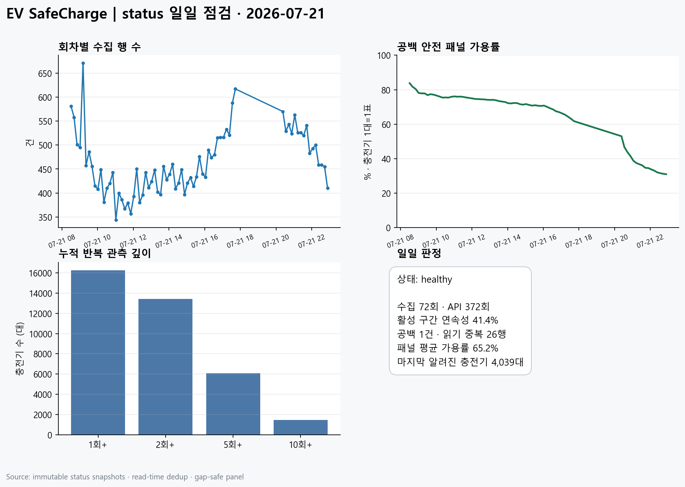

# status 일일 자동 점검 | 2026-07-21

| 항목 | 결과 |
|---|---|
| 상태 | **healthy** |
| 수집 회차 | 72회 |
| 수집 시간 | 2026-07-21 08:30:39 ~ 2026-07-21 22:53:13 |
| 중앙 수집 간격 | 10.0분 |
| 활성 구간 연속성 | 41.4% |
| API 호출 | 372 / 1000 (37.2%) |
| 행 수 | raw 33,368 / dedup 33,342 |
| 패널 가용률 | 평균 65.2% |
| 패널 알려진 충전기 | 마지막 4,039대 |

## 수집 공백

- 2026-07-21 17:43:17 → 2026-07-21 20:22:51: 159.6분 (약 31회 누락)

## 데이터 품질

- statId 결측: 0
- chgerId 결측: 0
- stat 결측: 0
- 유효하지 않은 상태코드: 0
- 읽기 단계 제거 중복행: 26

## 누적 현황 (2026-07-21 종료 기준)

- 고유 충전기: 16,245대
- 2회 이상 관측: 13,419대
- 5회 이상 관측: 6,061대
- 10회 이상 관측: 1,465대
- 충전기당 관측: 중앙값 3회 / 평균 8.4회

## 집계 원칙

- 원본 스냅샷은 수정하지 않는다.
- 중복은 읽기 단계에서만 제거한다.
- 가용률은 충전기 1대=1표인 패널 재구성 기준이다.
- 25분을 넘는 수집 공백 뒤에는 이전 상태를 이어 쓰지 않는다.

