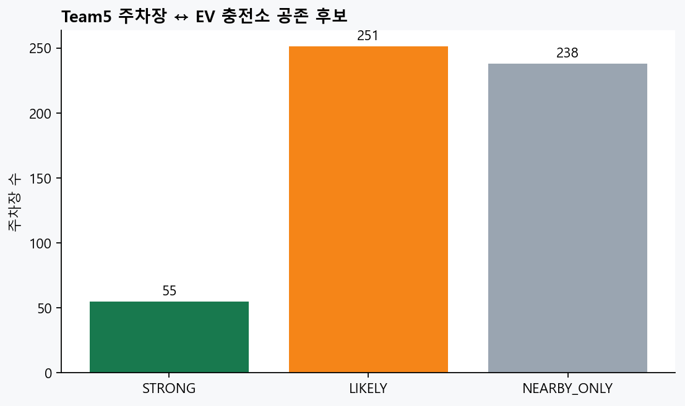
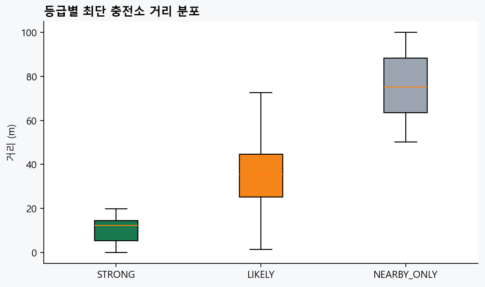
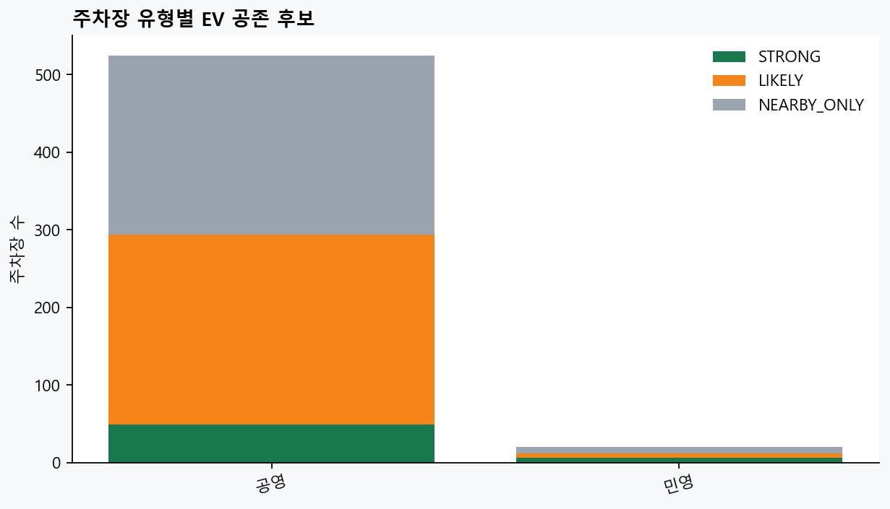
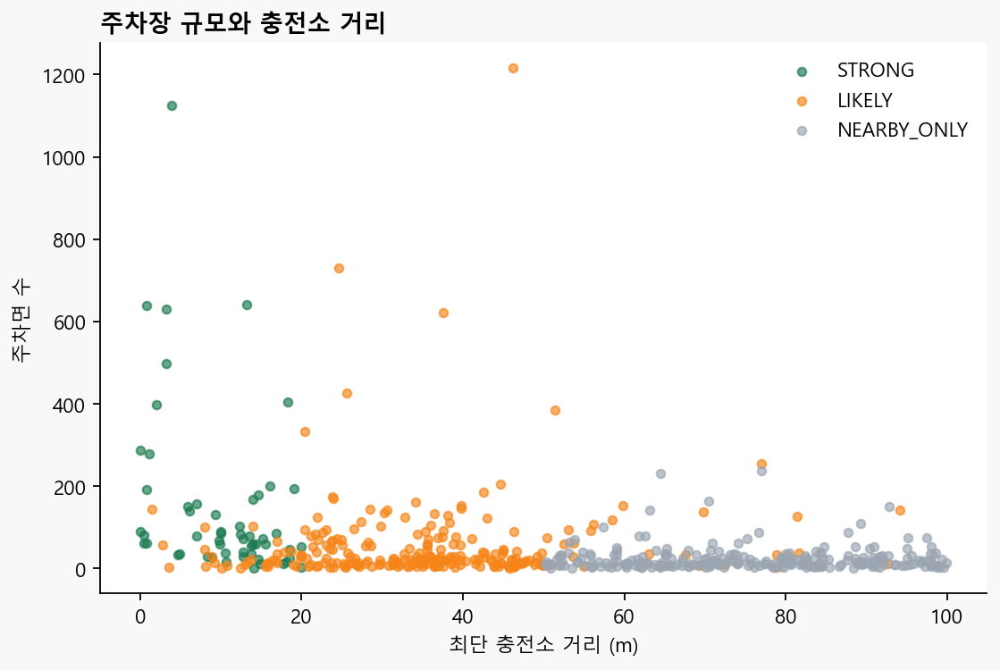

# Team5 주차장 중 EV 충전소 공존 후보 — EDA 보고서

## 결론

Team5 주차장 1,764개 중 **544개**가 충전소와 100m 이내로 연결됐다.
다만 1km 조인과 달리, 이 결과는 “주차장 안/바로 옆일 가능성”을 보려는 후보 추출이다.
**STRONG만도 현장·주소 표본 검증 전에는 확정값으로 표시하지 않는다.**

| 등급 | 주차장 수 | 의미 |
|---|---:|---|
| STRONG | 55 | 20m 이내 + 이름 또는 주소 숫자 근거 |
| LIKELY | 251 | 50m 이내 또는 100m 이내 추가 근거 |
| NEARBY_ONLY | 238 | 50~100m 근처일 뿐, 주차장 내부 주장 금지 |



## 1. 거리 분포

| 등급 | 주차장 수 | 중앙 거리 | 평균 거리 | 최대 거리 |
|---|---:|---:|---:|---:|
| STRONG | 55 | 12.3m | 10.4m | 19.9m |
| LIKELY | 251 | 35.6m | 36.2m | 94.2m |
| NEARBY_ONLY | 238 | 75.2m | 75.4m | 99.9m |



**관찰:** STRONG은 이름/주소 증거까지 있는 20m 이내 보수적 후보이고, LIKELY·NEARBY_ONLY는
거리만으로 같은 주차 구획이라고 단정할 수 없다.

## 2. 주차장 유형

| 주차장 유형 | STRONG | LIKELY | NEARBY_ONLY |
|---|---:|---:|---:|
| 공영 | 49 | 245 | 230 |
| 민영 | 6 | 6 | 8 |





## 3. 지금 활용 가능한 범위

- `parking_lots_with_ev_strong.csv`: 우선 검토·현장 검증 목록
- `parking_lots_with_ev_candidates.csv`: 주차장 단위 요약 목록
- `charger_parking_pairs_within_100m.csv`: 충전소↔주차장 개별 증거

### 권장 제품 규칙

| 등급 | 화면/피처 사용 |
|---|---|
| STRONG | “충전소가 있는 주차장 후보” 필터·주차 realtime 보조 정보 후보 |
| LIKELY | “인근 주차장 정보”로만 표시 |
| NEARBY_ONLY | 거리 정보만; 주차 점유율을 충전소 상태 근거로 사용 금지 |

## 4. 다음에 할 일 (우선순위)

1. **STRONG 55개 표본 검증** — 상위 10~20개를 지도·주소·시설 페이지로 확인해 false positive 비율 기록  
2. **검증 통과 기준 합의** — STRONG 중 이름·주소·좌표가 모두 맞는 대상을 `CONFIRMED`로 승격  
3. **D1에는 등급만 우선 결합** — `parking_ev_colocation_grade`, `parking_ev_spaces`를 보조 피처로 추가하고 점수 반영은 ②와 합의  
4. **2주 누적 후 관계 분석** — CONFIRMED/STRONG에서 `주차 점유율 ↔ 충전 가용률`을 시간 순서로 분석  

## 5. 주의

Team5 주차장은 공영·노상 등도 포함한다. 좌표가 가깝다는 것만으로 충전기가 같은 주차 구획에
있다고 확정할 수 없다. 이 파일은 **주차장 EV 충전소 후보군**이며, 서비스에서 “주차장 내 충전소”
배지를 표시하려면 STRONG 표본을 주소/현장 정보로 재검토해야 한다.

```text
DA① | Team5 parking EV co-location candidates | 20260725
```
