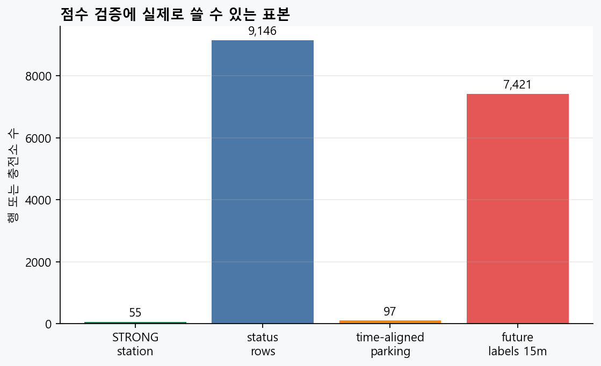
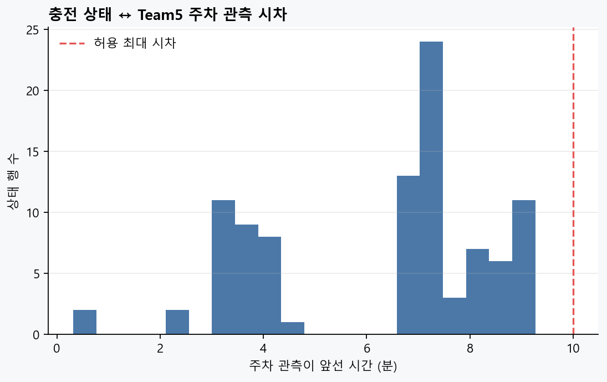

# Team5 주차 데이터 — 추천 점수 반영 검증

| 항목 | 값 |
|---|---|
| 생성 시각 | 2026-07-30T15:45:28+09:00 |
| 판정 | **PARKING_AUXILIARY_ONLY** |
| 추천 점수 반영 | **False** |
| 결론 | 점수 반영 근거 부족: Team5 시간 이력 14일 미달; t+15 미래 라벨 수 부족; insufficient labeled rows or calendar days for score evaluation |

## 판정 범위

- KOTSA 부분 추출본과 1km 근접 주차장 조인은 점수 입력에서 제외했다.
- `STRONG` 공존 후보만 사용했으며, 주차 관측은 충전 상태보다 최대 10분 이전인 값만 허용했다.
- 목표는 현재 상태가 아니라 `t+15분`의 사용 가능 충전기 존재 여부다. 미래 상태·ETA·추천 점수는 입력에 넣지 않았다.
- 이 검증은 실제 사용자의 도착·충전 성공 라벨이 없으므로, 그 라벨을 대체하지 않는다.

## 데이터 인벤토리

| 지표 | 값 |
|---|---:|
| 상태 이벤트 행 | N/A |
| 상태 panel 행 | 228,917 |
| 상태 기간 일수 | 8 |
| Team5 realtime 행 | 92,758 |
| Team5 기간 일수 | 8 |
| STRONG 공존 충전소 | 59 |
| STRONG cohort 상태 행 | 9,146 |
| 시간 동기화 주차 행 | 97 |
| t+15 미래 라벨 행 | 7,421 |
| 주차 동기화 t+15 라벨 행 | 64 |

## 성능 비교

_성능 비교를 실행하지 않음: 표본/시간 게이트 미달 또는 모델 실행 환경 미충족_

## 점수 반영 게이트

| 게이트 | 기준 | 결과 |
|---|---|---|
| 공간 확정성 | STRONG 공존 충전소 ≥ 10 | PASS |
| 시간 성숙도 | 동기화 주차 이력 ≥ 14일 | FAIL |
| 미래 라벨 | 주차 동기화 t+15 라벨 ≥ 500 | FAIL |
| 시간 분리 검증 | 테스트 ≥ 50행·2일 | FAIL |
| 성능 개선 | bootstrap 신뢰구간상 기준 모델보다 개선 | FAIL |

## 제품 처리

주차 잔여면·점유율은 추천 점수와 순위에 반영하지 않는다. 검증된 공존 후보의 보조 안내 문구로만 표시한다.

## 산출물

- `summary.json`: 기계판독 판정과 입력 범위
- `cohort_15m.csv`: STRONG cohort와 주차 동기화·미래 라벨 플래그 (분석 재현용)
- `metrics.csv`: 기준 모델/주차 추가 모델 비교 (가능한 경우)
- `strong_pairs_used.csv`: 이번 검증에서 사용한 공간 후보

## 그림

