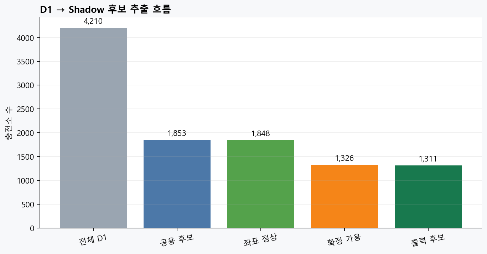
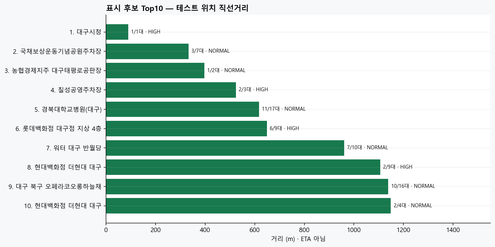
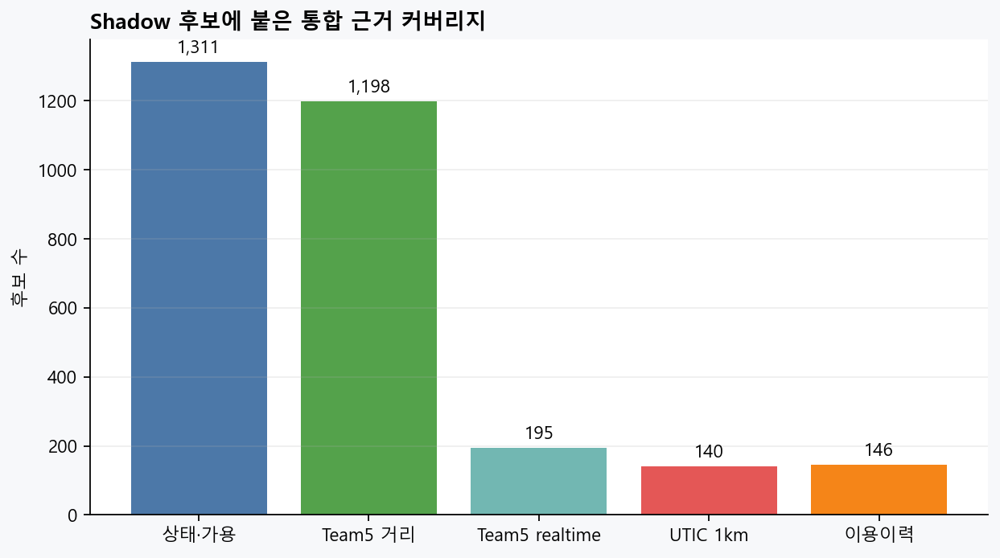

# D1 Shadow 추천 테스트 — 대구시청

| 항목 | 값 |
|---|---|
| 테스트 위치 | 대구시청 (35.8714, 128.6014) |
| D1 기준시각 | 2026-07-25T15:15:36.262723+09:00 |
| 전체 D1 | 4,210 |
| 출력 가능 후보 | 1,311 |
| A: 즉시 후보 | 255 |
| B: 확인 후 후보 | 1,056 |

## 출력 흐름

`D1 → 공용 후보 → 좌표 정상 → 확정 가용 ≥1 → 운영 중/미확인 → 신선도 tier → 직선거리 표시 순서`

이는 **통합 데이터 흐름 QA**다. 최종 점수·가중치·ETA·실패 위험도는 계산하지 않았으며,
AI·데이터 ②/백엔드 구현 전에는 이 결과를 실제 순위나 도착 성공 확률로 표현하지 않는다.

## 표시 후보 Top 10

| 표시 순서 | tier | 충전소 | 테스트 위치 직선거리 | 사용 가능/전체 | 신뢰도 | 운영 |
|---:|---|---|---:|---:|---|---|
| 1 | A: 즉시 후보 | 대구시청 | 90m | 1/1 | HIGH | Y |
| 2 | A: 즉시 후보 | 국채보상운동기념공원주차장 | 333m | 3/7 | NORMAL | Y |
| 3 | A: 즉시 후보 | 농협경제지주 대구태평로공판장 | 397m | 1/2 | NORMAL | Y |
| 4 | A: 즉시 후보 | 칠성공영주차장 | 524m | 2/3 | HIGH | Y |
| 5 | A: 즉시 후보 | 경북대학교병원(대구) | 618m | 11/17 | NORMAL | Y |
| 6 | A: 즉시 후보 | 롯데백화점 대구점 지상 4층 | 649m | 6/9 | HIGH | Y |
| 7 | A: 즉시 후보 | 워터 대구 반월당 | 961m | 7/10 | NORMAL | Y |
| 8 | A: 즉시 후보 | 현대백화점 더현대 대구 | 1106m | 2/9 | HIGH | Y |
| 9 | A: 즉시 후보 | 대구 북구 오페라코오롱하늘채 | 1139m | 10/16 | NORMAL | Y |
| 10 | A: 즉시 후보 | 현대백화점 더현대 대구 | 1149m | 2/4 | NORMAL | Y |

각 후보의 모든 근거는 [`top_candidates.csv`](./top_candidates.csv)의 `evidence` 열에 기록했다.

## 시각자료







## 제외 근거

| 제외 사유 | 충전소 수 |
|---|---:|
| 이용 제한 | 2,357 |
| 공용이나 좌표 없음/비정상 | 5 |
| 공용·좌표 정상이나 확정 가용 없음 | 522 |
| 현재 운영 중지로 표시 | 15 |

```
DA① | D1 shadow integration test | 20260725
```
