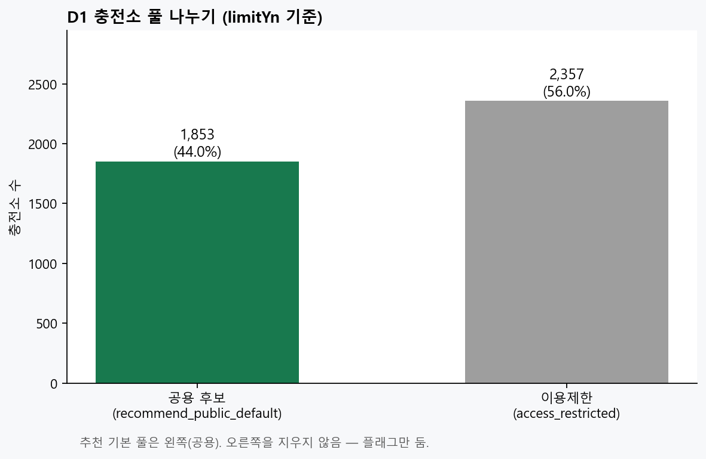
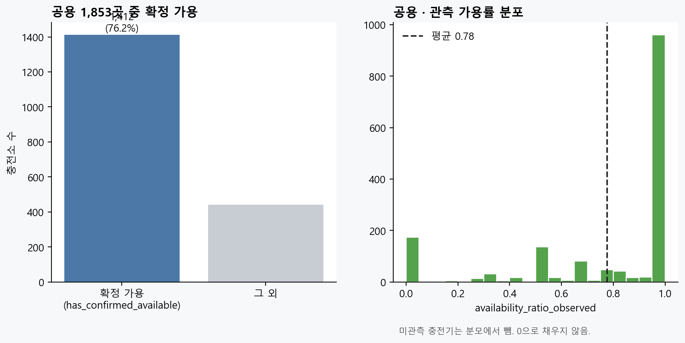
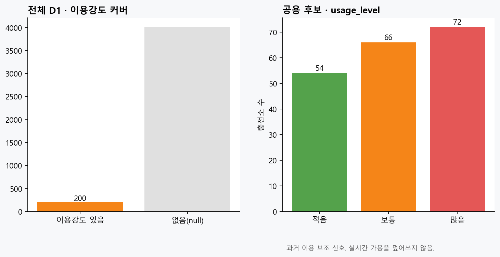
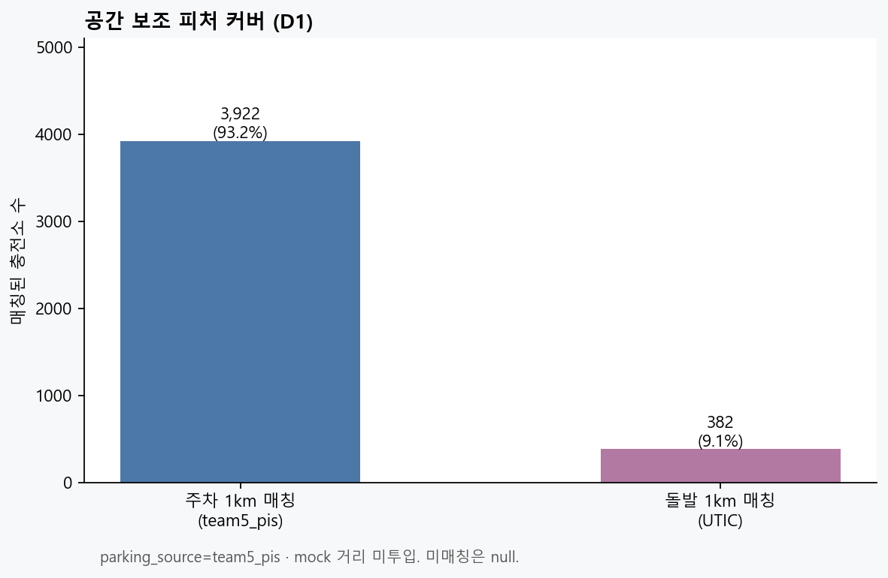

# D1 최신화가 의미하는 것 (쉬운 설명 + 그림)

| | |
|---|---|
| **기준시각 as_of** | `2026-08-06T20:06:55+09:00` |
| **파일** | `station_feature_snapshot_latest.csv` |
| **행** | 충전소 **4,210**곳 (1소=1행) |
| **점수** | 없음 → ②가 읽어서 씀 |

---

## 한 줄

> **지금 이 시각 기준**으로, 대구 충전소마다 “갈 만한지 보는 요약 카드”를 다시 뽑아 둔 것.
> 카드 안에는 **공용/제한**, **지금 비었나**, **예전에 얼마나 썼나**, **근처 주차·돌발**이 같이 적혀 있다.

---

## 숫자 해석 (이번 빌드)

| 숫자 | 뜻 | 이번 값 |
|---|---|---|
| 전체 소 | D1 행 수 | **4,210** |
| 공용 후보 | `recommend_public_default=true` (limitYn 전부 N) | **1,853** |
| 이용제한 | `access_restricted=true` (충전기 중 limitYn=Y 하나라도) | **2,357** |
| 공용 확정 가용 | 공용 중 `has_confirmed_available` | **1,412** (76.2%) |
| 공용 관측 가용률 평균 | 관측된 충전기만 분모 | **0.826** |
| 이용강도 붙은 소 | `history_observed` / usage_level | **200** |
| 주차 1km 매칭 | team5 PIS | **3,922** |
| 돌발 1km 매칭 | UTIC | **382** |

---

## 그림

### 01_public_vs_restricted.png



>공용 vs 이용제한 — 추천은 왼쪽 풀**

### 02_public_availability.png



>공용만 본 확정 가용 · 관측 가용률**

### 03_usage_level.png



>과거 이용강도 (보조 · 실시간 덮어쓰기 금지)**

### 04_parking_incident_coverage.png



>주차·돌발 공간 매칭 커버**

---

## 쉬운 비유

| D1 말 | 식당으로 치면 |
|---|---|
| as_of | 메뉴판을 찍은 **시각** |
| 공용 후보 | 아무나 들어갈 수 있는 집 |
| 이용제한 | 회원·거주자만 |
| 확정 가용 | “지금 빈자리 있다”고 **확인됨** |
| 관측 가용률 | 확인된 좌석 중 빈 비율 |
| usage_level | 예전에 손님이 많았는지 (적음/보통/많음) |
| nearest_parking_m | 근처 주차장까지 거리 |
| nearest_incident_m | 근처 사고·공사까지 거리 |

---

## ②에게 넘길 때

```text
D1 latest as_of=2026-08-06T20:06:55+09:00
기본 추천 풀: recommend_public_default=true (약 1853)
usage_level은 보조 신호 (실시간 가용 덮어쓰기 금지)
parking_source=team5_pis · traffic_source=utic
```

## 다시 뽑기

```bash
python apps/data-pipeline/processing/analysis/explain_d1_latest.py
# D1 자체 재빌드: docs/data/가이드/D1_최신화_쉬운설명.md 참고
```

```
DA① | D1 explain | 2026-08-06
```
