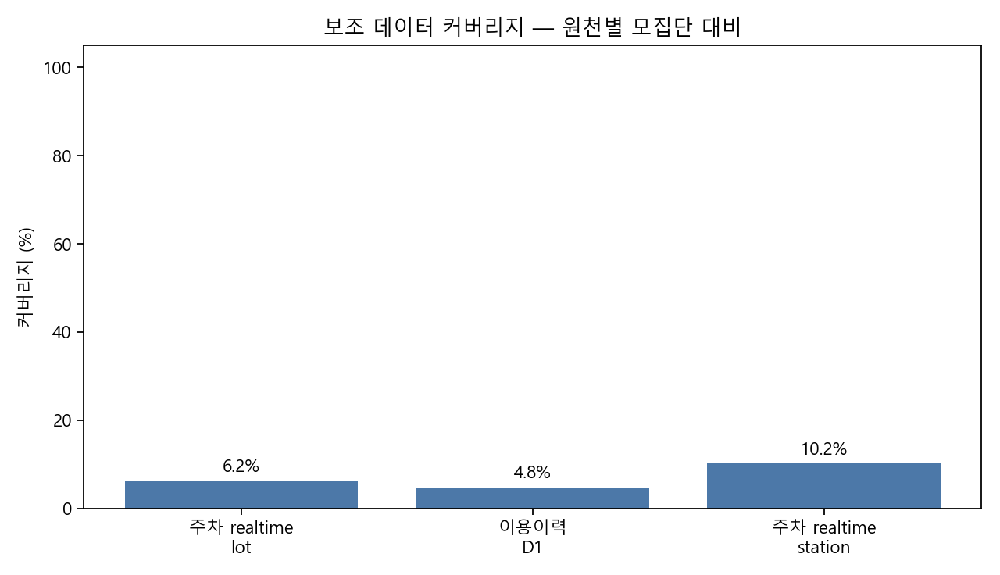
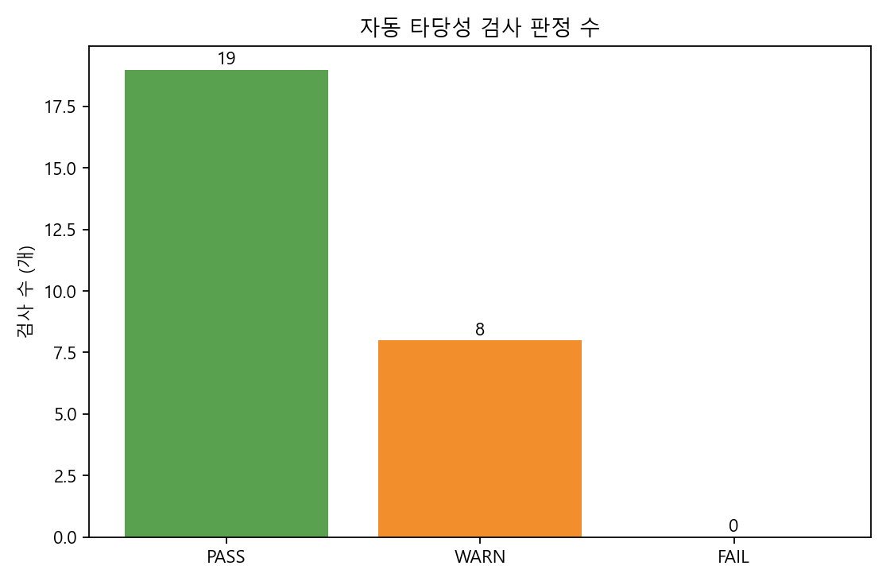

# 데이터 타당성 종합 검증

| 항목 | 내용 |
|---|---|
| 생성 시각 | 2026-08-03T21:07:11+09:00 |
| 방법 | 로컬 파일 불변식 · 원천 간 교차검증 · 시간/공간 정합성 · 외부 표본 검토 목록 |
| API 재호출 | 없음 |

## 결론

**MVP의 후보 필터와 상태 신선도 경고는 사용 가능하다.** 다만 주차·UTIC·이용이력은 보조 설명 신호이며,
도착 성공확률·ETA·장기 주차 혼잡은 이 데이터만으로 검증되지 않았다.

## 도메인별 자동 검사

| domain | PASS | WARN | FAIL |
| --- | --- | --- | --- |
| D1 | 6 | 0 | 0 |
| UTIC | 3 | 0 | 0 |
| 도시소통 | 1 | 2 | 0 |
| 상태 | 2 | 3 | 0 |
| 수집운영 | 1 | 0 | 0 |
| 이용이력 | 2 | 1 | 0 |
| 주차 | 2 | 2 | 0 |
| 충전소 | 2 | 0 | 0 |





## WARN / FAIL의 의미

| domain | check_id | status | observed | interpretation |
| --- | --- | --- | --- | --- |
| 상태 | STATUS_RELIABILITY_BATTERY | WARN | R2_gap25 | 기존 상태 시계열 신뢰성 조건의 재현 |
| 상태 | STATUS_CORPUS_DUPLICATE_PAIRS | WARN | 52 snapshots | 최신 tick은 정상이나 과거 52개 snapshot에 중복 key가 있어 시계열 집계 시 dedupe가 필요 |
| 상태 | STATUS_CADENCE_GAPS | WARN | 11 | 야간·PC off 구간 포함 11개 장기 공백 |
| 주차 | PARKING_REALTIME_SUBSET | WARN | 1 | 1개 realtime 주차장 ID가 최신 master에 없어 export 시점 차이 또는 master 보완이 필요 |
| 주차 | PARKING_REALTIME_COVERAGE | WARN | 428/3922 matched stations | parking_ev_colocation report |
| 도시소통 | TRAFFIC_LINK_ALIAS_DUPLICATES | WARN | 324 | 동일 linkId가 복수 roadName으로 반복된다. 도시 평균은 원천 행 기준이고, link 단위 분석은 dedupe가 필요 |
| 도시소통 | TRAFFIC_ETA_BOUNDARY | WARN | link geometry absent | dynamic/static contract |
| 이용이력 | USAGE_D1_COVERAGE | WARN | 200/4210 (4.8%) | integration readiness |

## 내적 타당성

- 충전기 master·상태·D1의 키 유일성, 수치 범위, null 정책을 검사했다.
- 주차 realtime은 master의 부분집합인지, 점유율 산식과 1km 반경이 맞는지 검사했다.
- 교통은 link 유일성과 속도·혼잡 등급의 방향성을, UTIC/이용이력은 반경·필터·중복을 검사했다.
- D1은 최신 원천과 다른 시점의 고정 스냅샷일 수 있으므로 drift는 데이터 오류가 아니라 **재빌드 필요 경고**로 분리했다.

## 측정타당성 — “사용 가능성”을 무엇으로 측정하는가

서비스 목표는 **“사용자가 ETA 후 도착했을 때 실제로 충전을 시작할 수 있는지”**다. 따라서
현재 API의 빈 충전기 수는 중요한 입력이지만, 목표 자체와 동의어가 아니다. 현재는 도착 결과
정답 라벨·경로 ETA·상태 전이 예측이 없으므로 도착 성공확률을 측정하거나 주장할 수 없다.

| variable | measurement_role | construct_fit | allowed_use | decision |
| --- | --- | --- | --- | --- |
| 도착 시 실제 충전 성공 | 목표 개념 / 정답 라벨 | 직접 | 측정 기준으로 정의만 가능 | 보류 |
| 현재 관측된 사용 가능 충전기 수 | 현재 시점의 직접 상태 지표 | 부분 직접 | 즉시 후보 필터 | MVP 사용 |
| 상태 갱신·관측 신선도 | 현재 상태 지표의 측정 품질 | 타당성 보정 | 신뢰도 경고·후보 tier | MVP 사용 |
| 전체 충전기 수 | 대기·고장 충격 완화 능력 | 구조적 proxy | 동률 후보의 실패 위험 완화 보조 | 보조 |
| 과거 이용량·회전율 | 장기 수요·이용 강도 proxy | 간접 | 표본이 있는 충전소의 장기 설명 | 보조 |
| 주차 점유율 | 접근·주차 가능성 proxy | 조건부 간접 | 검증된 STRONG 공존 후보의 안내 문구 | 직접 점수화 금지 |
| 도시 링크속도·UTIC 돌발 | 이동 마찰·주의 상황 proxy | 간접 | 경로 계산 전 경고·도시 맥락 | ETA 대체 금지 |
| ETA 후 예상 상태 | 목표와 가장 가까운 선행 예측치 | 직접에 가까움 | 현재 미사용 | 향후 핵심 측정치 |

### 현재 측정의 해석 규칙

- `available_count`는 **관측 시점** 충전 가능성의 부분 직접 측정치다. `observed_count=0`을 0개로 바꾸지 않는다.
- 신선도는 사용 가능성의 구성요소가 아니라, `available_count`가 믿을 만한지 판단하는 **측정 품질 변수**다.
- 충전기 수는 현재 빈자리의 측정치가 아니라, 한 대 고장·사용중일 때의 실패 위험을 완화하는 구조적 proxy다.
- 과거 이용량·회전율은 장기 수요 proxy이고, 현재 가용성이나 ETA 후 상태를 대신하지 않는다.
- 주차 점유율은 검증된 같은 시설(STRONG)에서만 접근성 보조 정보다. 1km 조인을 충전기 상태로 해석하지 않는다.
- ETA 후 예상 상태가 목표에 가장 가깝지만, 현재 `eta_minutes`는 0건이라 아직 측정 불가다.

## 신뢰성

- 상태 수집의 별도 R1–R6 검사와 최신 파일 freshness를 재사용했다.
- 상태 API는 변경분 feed이므로, 관측되지 않은 충전기를 사용 불가로 해석하지 않는다.
- 주차 realtime은 일부 주차장만 포함하고, PC 기반 UTIC은 서버 상시 운영 데이터가 아니다.

## 외적 타당성 경계

- 대상은 대구 MVP·공용 후보 중심이며, 다른 도시·계절·사용자 목적에 일반화할 수 없다.
- 1km 주차 매칭은 “주변 주차장”이지 “충전소 내부 주차장”이 아니다. 100m STRONG 후보도 외부 지도·주소 확인 전에는 확정 표현을 금지한다.
- 실제 충전 성공/도착 시 가용성 정답 라벨이 없어 추천 성공확률의 외적 타당성은 **보류**다.

## 수동 외부 표본 검토

- `external_review_samples/parking_strong_external_review_sample.csv`: STRONG 주차 공존 후보 0개
- `external_review_samples/usage_join_external_review_sample.csv`: 이용이력 공간조인 후보 20개

각 파일의 `map_verified`, `external_address_match`, `review_note`를 지도·주소 대조 후 기록한다.

## 재검증 조건

1. 최신 pull 직후 D1을 재생성하고 D1 drift WARN을 해소한다.
2. STRONG 주차 표본을 외부 지도·주소로 확인한다.
3. 상태·주차 이력이 2주 이상 누적된 뒤 시간대 안정성과 주차–가용 관계를 재검증한다.
4. ETA와 충전 성공확률은 경로 ETA·도착 후 결과 라벨을 확보한 뒤 별도 검증한다.

```text
DA① | offline data validity assessment | 20260803
```
