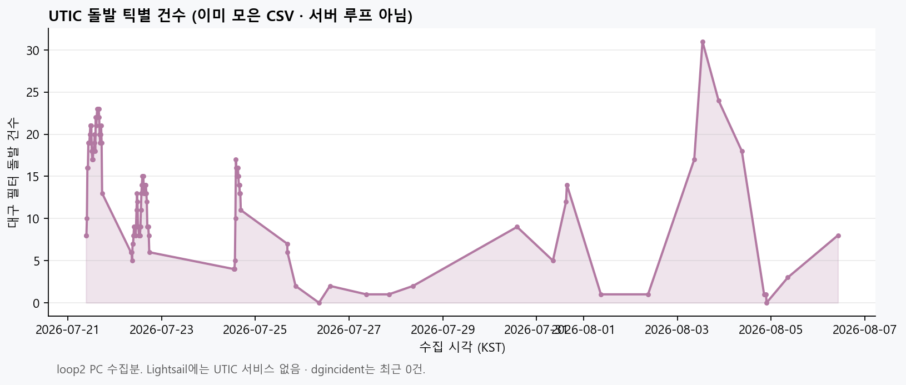
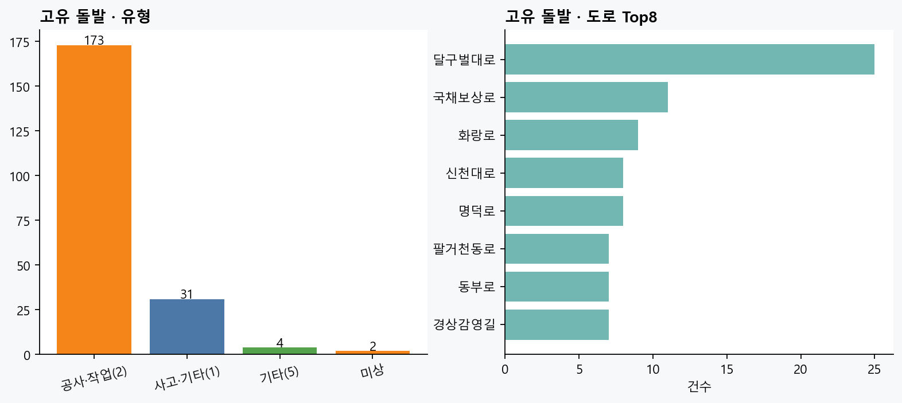
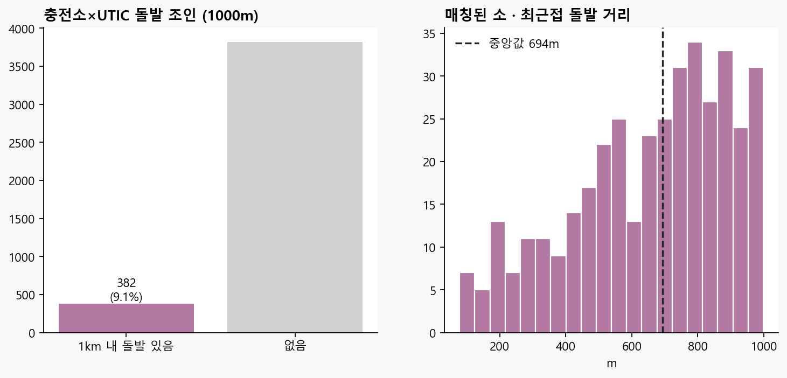
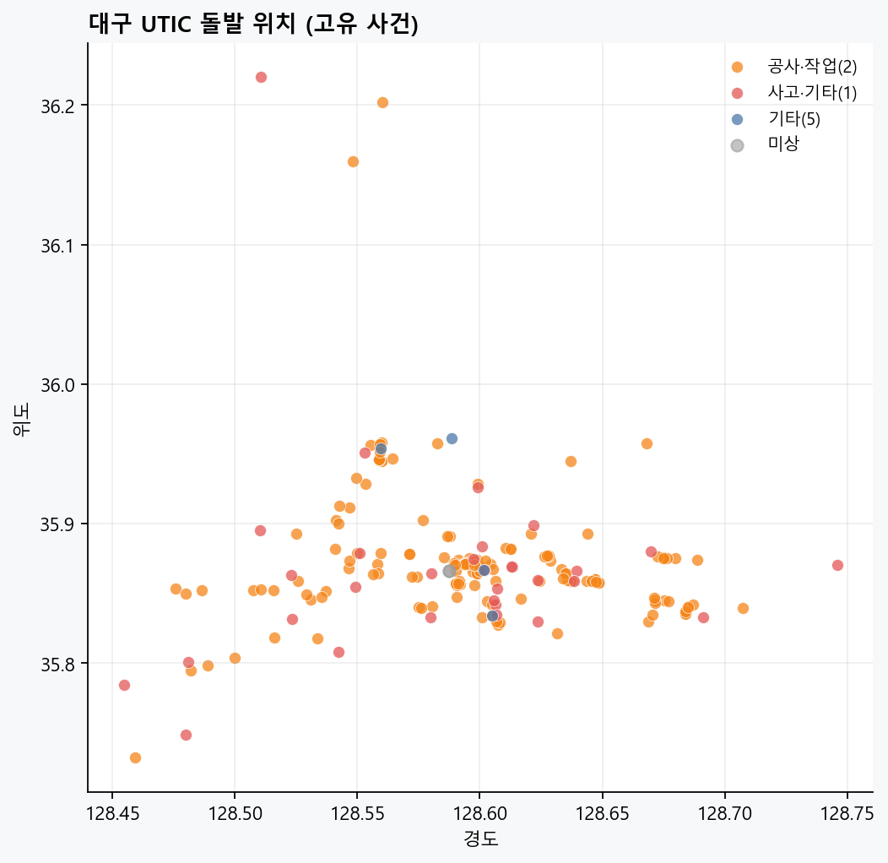

# UTIC 돌발 분석 (모아둔 것만 · 서버 루프 아님)

| | |
|---|---|
| **생성** | 2026-08-06T20:48:24+09:00 |
| **원천** | `docs/data/loops/loop2` UTIC CSV |
| **구간** | 2026-07-21 09:21:28 ~ 2026-08-06 10:14:24 |
| **틱** | 116 |
| **고유 돌발** | 210 |
| **서버** | Lightsail에 UTIC **안 올림** · 이 리포트는 오프라인 |

## 한 줄

> 7/21~7/22에 PC로 받아 둔 UTIC 대구 돌발을 다시 본 것. 
> **실시간 서버 수집이 아님.** dgincident(대구)는 지금 0건이라 이번 그림은 UTIC 이력 중심.

## 숫자

- 틱당 대구 건수: 대략 **12** (median)
- 유형: `{'공사·작업(2)': 173, '사고·기타(1)': 31, '기타(5)': 4, '미상': 2}`
- 충전소 1km 조인: **382** / 4201 (rate=0.0909)

## 그림

### 01_incident_count_by_tick.png



**틱별 돌발 건수**

### 02_type_and_roads.png



**유형·도로 Top**

### 03_station_join_coverage.png



**충전소 1km 조인**

### 04_incident_map.png



**좌표 산점도**

## 분석으로 쓸 만함 / 아님

| | |
|---|---|
| ✅ | 소 근처 경고 (`nearest_incident_m`) · 공사 많은 도로 파악 |
| ❌ | 단독 시계열 ML (건수 적음) · 지금 서버에 UTIC 올리기 |

## 재실행

```bash
python apps/data-pipeline/processing/analysis/analyze_utic_incidents.py
```

```
DA① | UTIC incident offline report | 20260806
```
