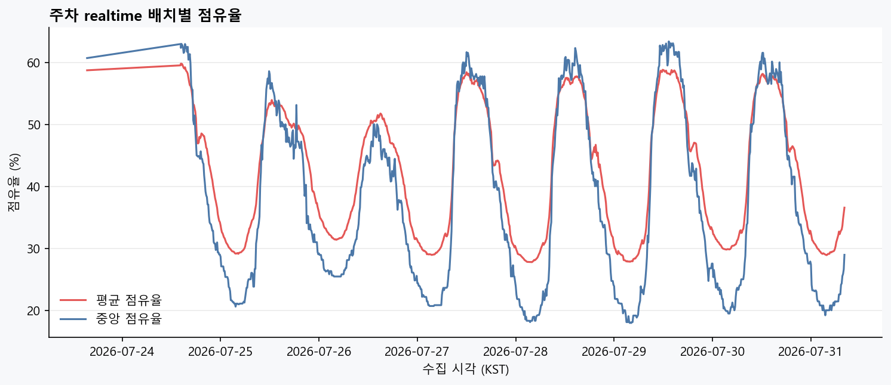
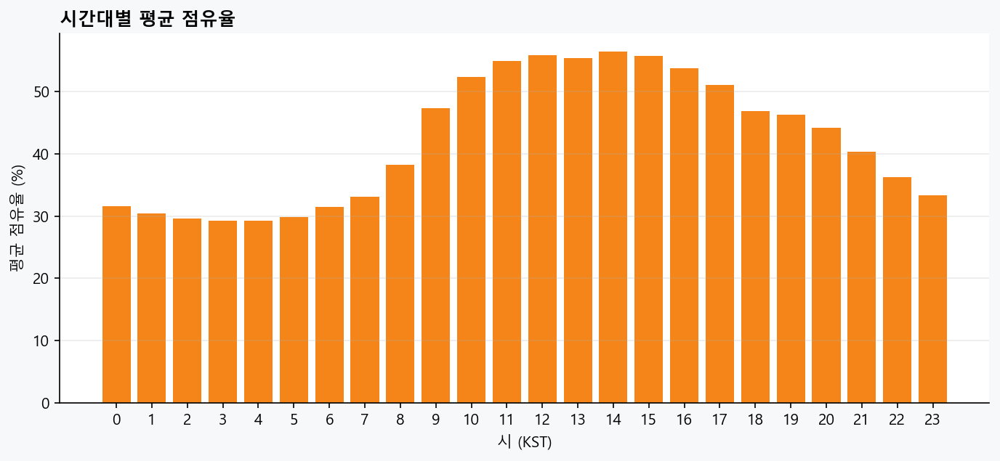
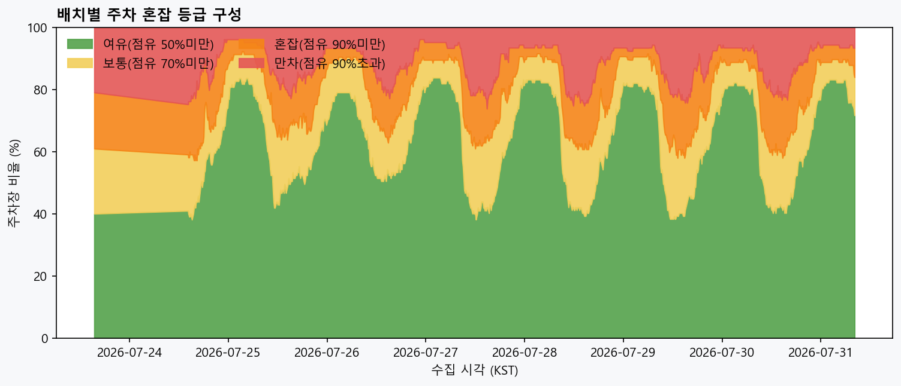
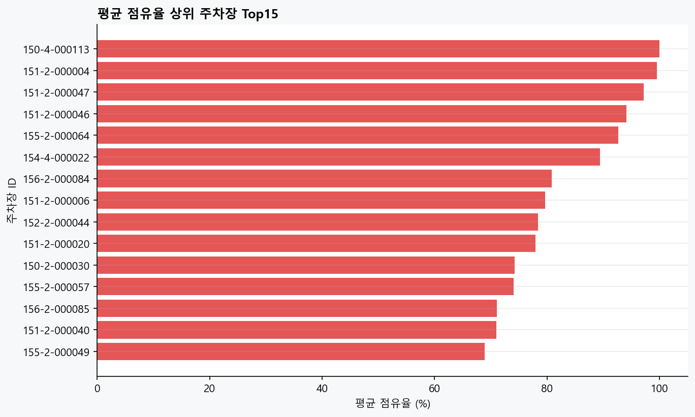
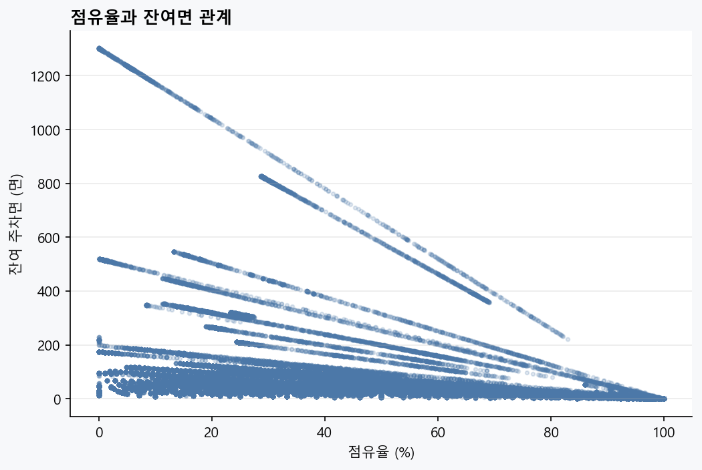

# Team5 PIS 주차 realtime — 초기 혼잡 EDA

| | |
|---|---|
| **생성** | 2026-07-31T08:33:20+09:00 |
| **원천** | `docs/data/extracted/parking/team5_full_snapshot_20260725_134854/parking_realtime_status.csv` |
| **범위** | 2026-07-23 15:26:52 ~ 2026-07-31 08:10:02 |
| **단위** | Team5 DB가 적재한 10분 배치 |
| **해석 단계** | **초기 패턴** — 9개 날짜, 장기 ‘평소’ 판단 금지 |

---

## 1. 요약

- realtime 행: **104,638**
- 주차장: **108**
- 수집 배치: **977**
- 전체 평균 점유율: **41.9%**
- 전체 중앙 점유율: **34.2%**
- 만차 상태 행 비율: **11.5%**

현재 이력은 7/23 일부 + 7/24 + 7/25 일부다. 주말·평일과 시간대가 충분히 반복되지 않았으므로,
“평소 자주 혼잡한 주차장” 확정값이 아니라 **추가 수집 전 초기 관찰값**으로만 쓴다.

---

## 2. 시간대별 초기 패턴

| 시간 | 배치 수 | 평균 점유율 |
|---|---:|---:|
| 00시 | 42 | 31.5% |
| 01시 | 42 | 30.4% |
| 02시 | 42 | 29.6% |
| 03시 | 42 | 29.2% |
| 04시 | 42 | 29.3% |
| 05시 | 42 | 29.8% |
| 06시 | 42 | 31.4% |
| 07시 | 42 | 33.1% |
| 08시 | 38 | 38.2% |
| 09시 | 36 | 47.4% |
| 10시 | 36 | 52.4% |
| 11시 | 36 | 55.0% |
| 12시 | 36 | 55.9% |
| 13시 | 36 | 55.4% |
| 14시 | 44 | 56.5% |
| 15시 | 43 | 55.8% |
| 16시 | 42 | 53.8% |
| 17시 | 42 | 51.1% |
| 18시 | 42 | 46.9% |
| 19시 | 42 | 46.3% |
| 20시 | 42 | 44.2% |
| 21시 | 42 | 40.4% |
| 22시 | 42 | 36.2% |
| 23시 | 42 | 33.4% |

---

## 3. 평균 점유율 상위 주차장

| 순위 | 주차장 ID | 관측 수 | 평균 점유율 | 평균 잔여면 |
|---:|---|---:|---:|---:|
| 1 | 150-4-000113 | 977 | 100.0% | 0.0 |
| 2 | 151-2-000004 | 977 | 99.5% | 1.2 |
| 3 | 151-2-000047 | 977 | 97.2% | 6.1 |
| 4 | 151-2-000046 | 977 | 94.1% | 4.7 |
| 5 | 155-2-000064 | 977 | 92.6% | 3.3 |
| 6 | 154-4-000022 | 977 | 89.4% | 40.1 |
| 7 | 156-2-000084 | 977 | 80.8% | 21.3 |
| 8 | 151-2-000006 | 977 | 79.6% | 6.5 |
| 9 | 152-2-000044 | 977 | 78.4% | 30.9 |
| 10 | 151-2-000020 | 977 | 77.9% | 5.3 |
| 11 | 150-2-000030 | 977 | 74.2% | 37.6 |
| 12 | 155-2-000057 | 977 | 74.0% | 16.1 |
| 13 | 156-2-000085 | 977 | 71.1% | 37.9 |
| 14 | 151-2-000040 | 977 | 71.0% | 10.4 |
| 15 | 155-2-000049 | 977 | 68.9% | 10.0 |

> 주차장 이름·주소는 `parking_lot_info.csv`의 `pklt_id`로 연결한다.

---

## 4. SafeCharge 활용 범위

| 가능 | 아직 금지 |
|---|---|
| 최신 배치의 잔여면·점유율을 D1 보조 정보로 사용 | 2.5일 이력으로 장기 혼잡도 점수 확정 |
| 2주 이상 쌓인 뒤 주차장×요일×시간 프로파일 생성 | 주차 혼잡만으로 추천 순위 결정 |
| 충전소↔주차장 1km 조인 품질 점검 | Team5 소유 DB를 합의 없이 지속 복제 |

권장 누적 방식: Team5 DB가 보관한 새 realtime 행만 **주기적 incremental export**한다.
10분마다 별도 원천 호출을 만들 필요는 없고, DB 보관·접근 정책은 Team5와 합의한다.

---

## 5. 그림

### 01_fleet_occupancy_timeseries.png



### 02_hourly_occupancy.png



### 03_congestion_mix_timeseries.png



### 04_top_congested_lots.png



### 05_occupancy_vs_remaining.png




```
DA① | Team5 PIS parking EDA | 20260725
```
