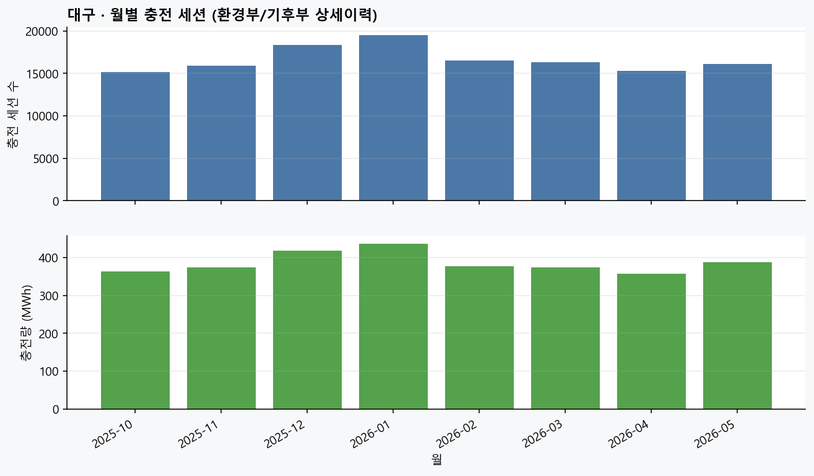
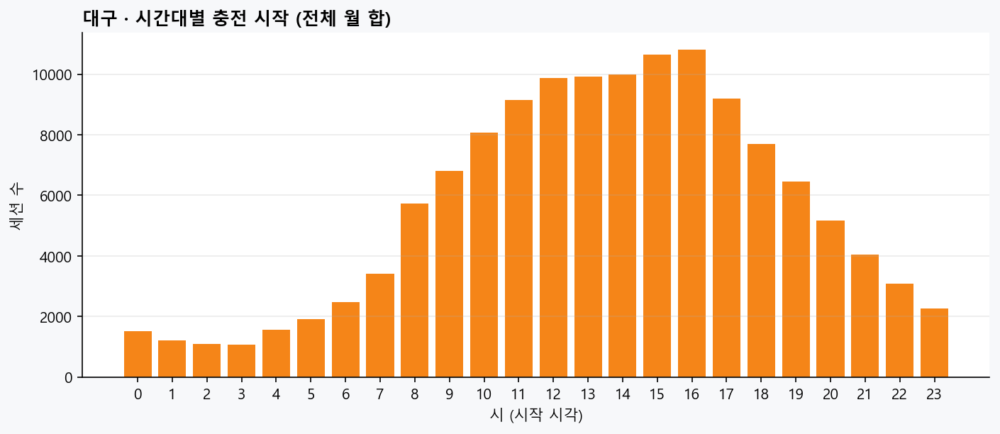
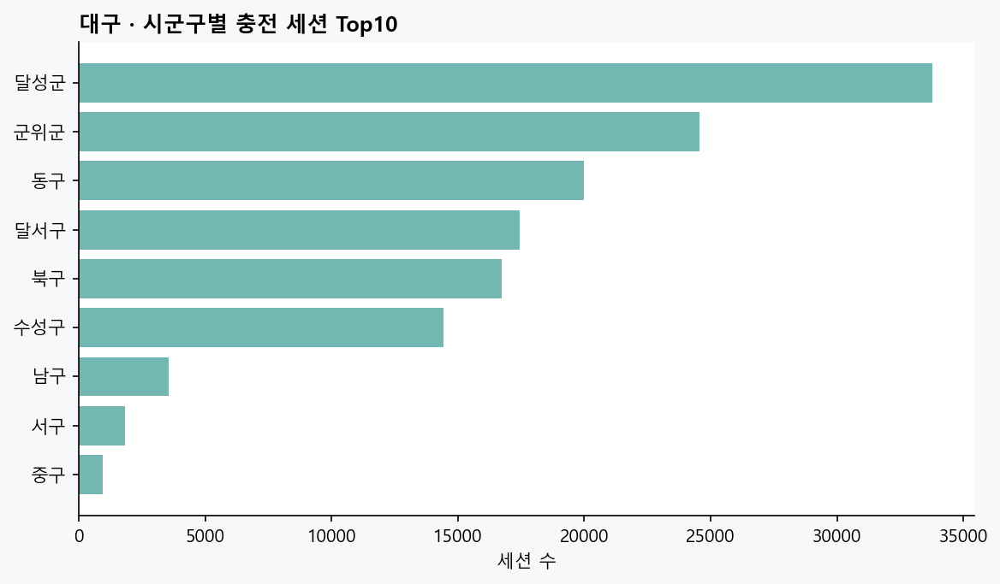
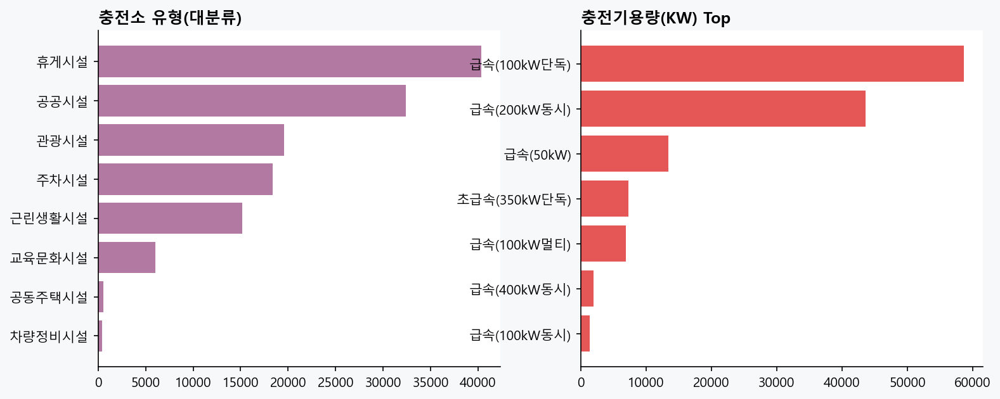
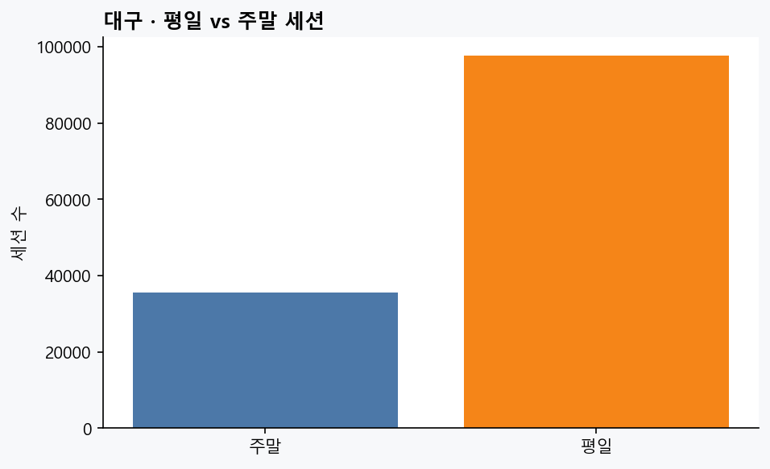

# 환경부·기후부 충전이력 — 대구 추출 · 분석 의미 보고

| | |
|---|---|
| **생성** | 2026-07-24T15:27:21+09:00 |
| **원천** | 환경부/기후부 충전기 충전이력(상세내역) xlsx × 8 |
| **기간(파일)** | 2025-10 ~ 2026-05 |
| **필터** | `지역`=대구광역시 **그리고** `주소`가 대구광역시로 시작 · 결측/타시도 제외 |
| **대구 세션** | **133,176** |
| **충전소(이름+시군구)** | **130** |
| **총 충전량** | **3,086,457 kWh** (~3,086.5 MWh) |

---

## 1. 이 데이터가 뭐냐

공공(환경부→기후부) **급속·공용 쪽 충전이력 상세**다. 한 행 = 충전 **1세션**.
우리가 루프로 받는 EvCharger **실시간 상태(stat)** 와는 다르다.

| | 충전이력(이번) | EvCharger status(루프) |
|---|---|---|
| 시점 | **끝난 충전**의 시작·종료·kWh | **지금** 가능/충전중 |
| 주기 | 월별 공표 파일 | 5~10분 스냅 |
| SafeCharge 용도 | **이용강도·시간대 수요** 보조 | **지금 갈 수 있나** |

---

## 2. 왜 모으고 대구만 뽑나

1. **추천·점수(②)에 과거 이용 신호**를 줄 수 있다 — `usage_level`과 같은 계열.  
2. **시간대 프로파일** — 언제 충전이 몰리는지 (가용률·혼잡과 나란히 보면 ‘출발 창’).  
3. **시군구·시설유형** — 공영주차·공공·휴게 등 어디가 바쁜지.  
4. 실시간 미관측·낡은 status일 때 **‘평소에 바쁜 곳’** 보정용 (실시간 덮어쓰기 금지).

전국 파일은 수십 MB×여러 달이라 **대구만** 남겨야 파이프·깃·분석이 감당 가능하다.

---

## 3. 이번 추출 요약 숫자

- 월 수: **8** (2025-10, 2025-11, 2025-12, 2026-01, 2026-02, 2026-03, 2026-04, 2026-05)  
- 세션/월 median: **16,194**  
- 세션당 충전량 평균: **23.18 kWh** · 중앙 **21.35**  
- 세션당 충전시간 평균: **28.0분** (파싱된 행 기준)  
- 시군구 Top: `{'달성군': 33766, '군위군': 24546, '동구': 19991, '달서구': 17439, '북구': 16738}`  
- 유형 Top: `{'휴게시설': 40322, '공공시설': 32396, '관광시설': 19564, '주차시설': 18390, '근린생활시설': 15141}`  

---

## 4. 그림

### 01_monthly_sessions_kwh.png



**월별 세션·충전량**

### 02_hourly_start.png



**시간대별 시작**

### 03_district_sessions.png



**시군구**

### 04_station_type_capacity.png



**유형·용량**

### 05_weekday_weekend.png



**평일/주말**

---

## 5. SafeCharge에 붙이는 의미 (①→②)

| 활용 | 의미 | 주의 |
|---|---|---|
| 월·시간대 수요 | ‘언제 바쁜 도시인가’ | 공표 급속 위주 → **완속·아파트 과소** 가능 |
| 소별 세션 강도 | usage_level 보강·검증 | 충전소명 조인 ≠ 항상 `statId` |
| 평일/주말 | 관광·시내 패턴 | 인과 단정 금지 |
| 시설유형 | 공영주차 vs 공공기관 | EvCharger limitYn과 별개 |

**하지 말 것:** 이력 kWh로 실시간 `available_count` 덮어쓰기.

---

## 6. 산출 파일

| 파일 | 내용 |
|---|---|
| `daegu_me_history_all.csv` | 대구 전체 세션 |
| `daegu_me_history_YYYY-MM.csv` | 월별 |
| `monthly_summary.csv` | 월 집계 |
| `station_intensity.csv` | 소별 세션·kWh |
| `summary.json` | 메타 |

```
DA① | ME/Climate history Daegu | 20260724
```
