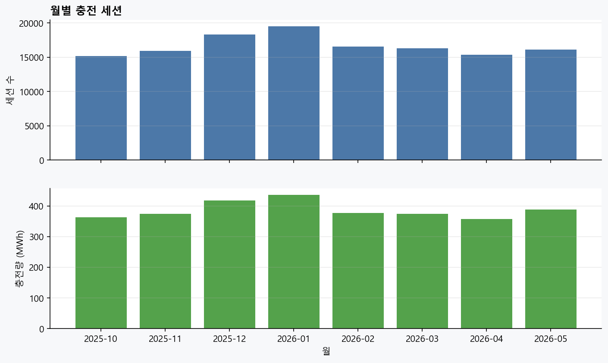
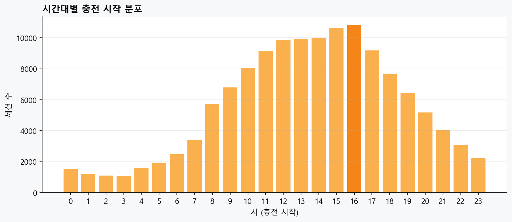
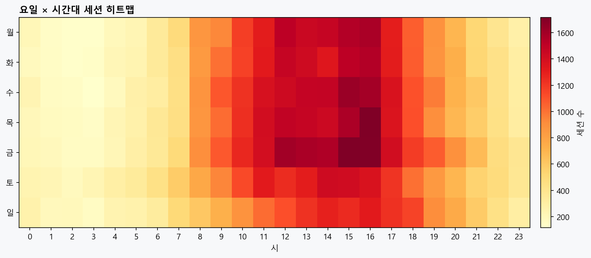
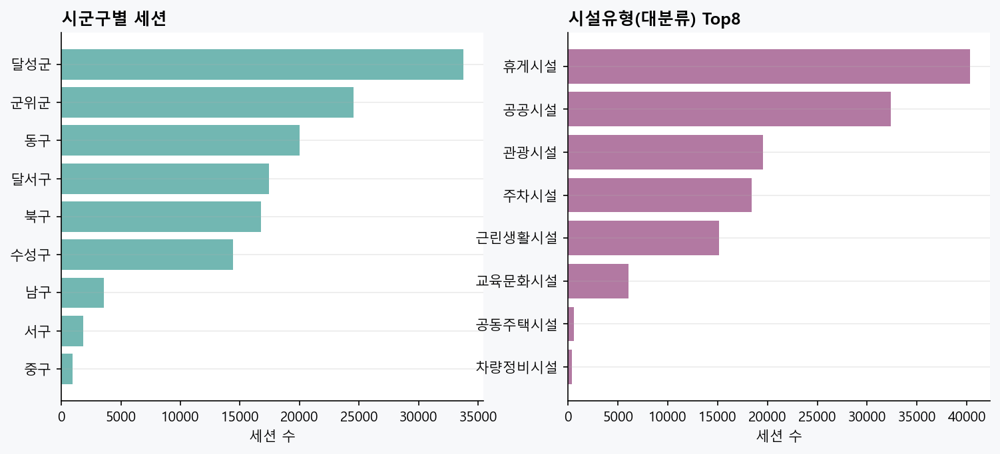
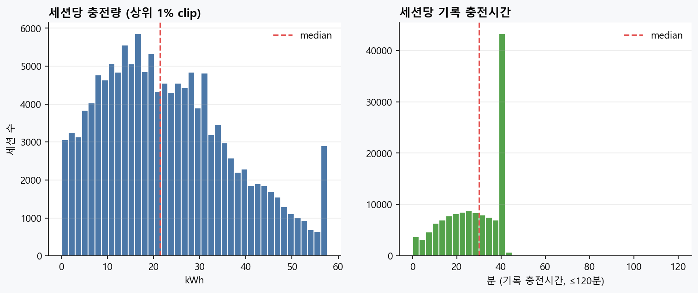
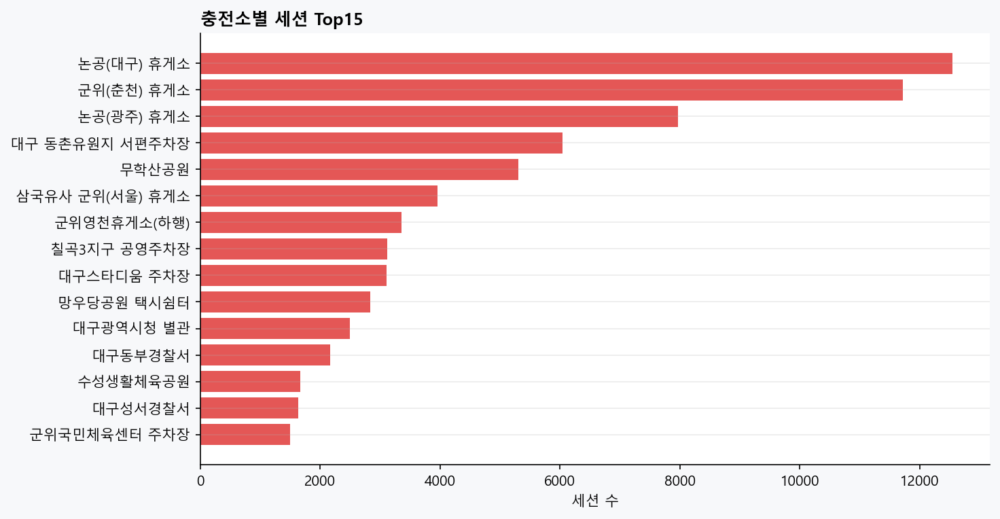
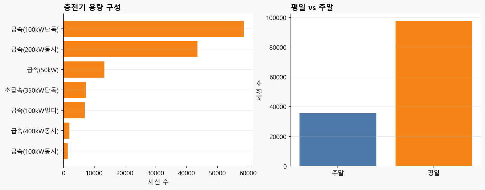

# EDA 보고서 — 대구 공공 충전이력 (Historical Demand)

| | |
|---|---|
| **생성** | 2026-07-24T15:47:28+09:00 |
| **원천** | `docs/팀공유/충전이력_대구_20260724/daegu_me_history_all.csv` |
| **기간** | 2025-10 ~ 2026-05 (8개월) |
| **필터** | `지역`=대구광역시 AND `주소`가 대구광역시로 시작 |
| **역할** | EV SafeCharge **Historical Demand** (실시간 status / ETA와 분리) |

---

## 1. 한 줄 결론

대구 공용·급속 충전이력 **133,176세션**은 지역 혼입 없이 깨끗하고,  
**오후 2~4시(특히 16시)·금요일 오후**에 수요가 몰린다.  
세션 수·시간대·소별 강도 EDA에는 **지금 상태 그대로 사용 가능**하다.  
다만 `충전시간`과 (종료−시작) 불일치가 약 **1.54%** 있어,  
**점유율(occupancy) 재구성**에는 별도 규칙이 필요하다.

---

## 2. 데이터 개요

| 항목 | 값 |
|---|---:|
| 세션 | **133,176** |
| 충전소(이름) | **131** |
| 충전소(이름+시군구) | **130** |
| 충전기(소×충전기ID) | **242** |
| 총 충전량 | **3,086,456.75 kWh** (~3,086.5 MWh) |
| 세션당 충전량 평균 / 중앙 | 23.18 / 21.35 kWh |
| 기록 충전시간 평균 / 중앙 | 27.98 / 29.97 분 |
| 주말 세션 비율 | 26.7% |

### 품질 체크

| 검사 | 결과 |
|---|---:|
| 완전 중복 행 | **0** |
| 시작시각 결측 | **0** |
| 종료시각 결측 | **0** |
| 지역 전부 대구광역시 | **True** |
| 주소 전부 대구광역시 시작 | **True** |
| \|기록분 − (종료−시작)\| > 5분 | **2,056** (1.54%) |
| 위 차이 > 60분 | **668** (0.50%) |

> 전처리에서 타시도·오분류 **7,083건**(광주대구고속도로, 서대구일로, 강진 대구면 등)은 이미 제거됨.

---

## 3. 시간 패턴

### 3.1 월별

| 월 | 세션 |
|---|---:|
| 2025-10 | 15,194 |
| 2025-11 | 15,922 |
| 2025-12 | 18,329 |
| 2026-01 | 19,477 |
| 2026-02 | 16,537 |
| 2026-03 | 16,303 |
| 2026-04 | 15,330 |
| 2026-05 | 16,084 |

- **피크 월:** 2026-01 (19,477세션)
- 동절기(12~1월)가 높고, 10·4월이 상대적으로 낮다.

### 3.2 시간대 · 요일

- 시작 시각 피크 시각: **16시**
- 요일×시간 최다 슬롯: **금 15시** (1,717세션)
- 패턴: 오전부터 상승 → **14~16시 고점** → 저녁 완만 하락 · 심야 최저
- 요일: **금요일**이 가장 바쁘고, 일요일이 상대적으로 적다

SafeCharge 해석: `도착 예정 시각`이 이 구간에 걸리면 **Busy Risk**를 올리는 근거로 쓸 수 있다  
(실시간 Available과 **곱/가산**하는 보조 신호. 실시간 덮어쓰기 금지).

---

## 4. 공간 · 시설

### 4.1 시군구

| 시군구 | 세션 |
|---|---:|
| 달성군 | 33,766 |
| 군위군 | 24,546 |
| 동구 | 19,991 |
| 달서구 | 17,439 |
| 북구 | 16,738 |
| 수성구 | 14,412 |
| 남구 | 3,539 |
| 서구 | 1,820 |
| 중구 | 925 |

달성·군위 비중이 큰 이유: **고속도로 휴게소(논공·군위 등)** 세션이 큼.  
시내 수요만 보고 싶으면 휴게시설을 분리한 서브셋 EDA가 필요하다.

### 4.2 시설유형 (대분류)

| 유형 | 세션 |
|---|---:|
| 휴게시설 | 40,322 |
| 공공시설 | 32,396 |
| 관광시설 | 19,564 |
| 주차시설 | 18,390 |
| 근린생활시설 | 15,141 |
| 교육문화시설 | 6,041 |
| 공동주택시설 | 565 |
| 차량정비시설 | 394 |

### 4.3 충전소 Top15

| 순위 | 충전소 | 세션 |
|---|---|---:|
| 1 | 논공(대구) 휴게소 | 12,547 |
| 2 | 군위(춘천) 휴게소 | 11,725 |
| 3 | 논공(광주) 휴게소 | 7,968 |
| 4 | 대구 동촌유원지 서편주차장 | 6,042 |
| 5 | 무학산공원 | 5,304 |
| 6 | 삼국유사 군위(서울) 휴게소 | 3,958 |
| 7 | 군위영천휴게소(하행) | 3,353 |
| 8 | 칠곡3지구 공영주차장 | 3,116 |
| 9 | 대구스타디움 주차장 | 3,103 |
| 10 | 망우당공원 택시쉼터 | 2,832 |
| 11 | 대구광역시청 별관 | 2,498 |
| 12 | 대구동부경찰서 | 2,169 |
| 13 | 수성생활체육공원 | 1,665 |
| 14 | 대구성서경찰서 | 1,634 |
| 15 | 군위국민체육센터 주차장 | 1,494 |

---

## 5. 충전량 · 기기 · 출력 버킷

- 충전기타입: 대부분 **DC콤보**
- 세션당 kWh 중앙값 **~21.4** — 급속 단기 충전 패턴과 일치
- **완속(slow) 세션: 0건** → 본 Historical Demand는 사실상 **급속 전용**

| 명목 출력 버킷 | 세션 | 비율 |
|---|---:|---:|
| 50kW | 13,377 | 10.0% |
| 100kW | 66,954 | 50.3% |
| 200kW | 43,586 | 32.7% |
| 350kW | 7,310 | 5.5% |
| 400kW+ | 1,949 | 1.5% |

---

## 6. 그림

### 01_monthly.png



**월별 세션·충전량**

### 02_hourly.png



**시간대별 시작 분포**

### 03_dow_hour_heatmap.png



**요일×시간 히트맵**

### 04_district_type.png



**시군구·시설유형**

### 05_kwh_duration.png



**충전량·기록시간 분포**

### 06_top_stations.png



**충전소 Top15**

### 07_capacity_weekend.png



**용량·평일/주말**


---

## 7. SafeCharge에서의 역할

```
실시간 Status  +  Historical Demand(본 데이터)  +  ETA
        │                    │                      │
   지금 Available      시간대·소별 수요 위험         도착시각
        └──────────── Busy Risk / Arrival Availability ──→ Top-N
```

| 지금 쓸 수 있는 것 | 아직 하면 안 되는 것 |
|---|---|
| 월·시간·요일 수요 프로파일 | 이력 kWh로 실시간 available 덮어쓰기 |
| 소별 이용강도 (`station_intensity`) | duration mismatch 행으로 점유율 단정 |
| Busy Risk 보조 피처 | 충전소명만으로 EvCharger `statId` 조인 확정 |

**다음 산출물 후보:** `station_hourly_profile.csv`  
(`station` × `dow` × `hour` → session_count, avg_kwh, avg_duration, demand_score)  
+ EvCharger **statId 매핑** · 관측일수 정규화.

---

## 8. 제품 범위 결정 (추가) — 완속 / kW

팀·리뷰 합의안을 EDA 맥락에 고정한다.

### 8.1 결론

| 정책 | 결정 |
|---|---|
| MVP 추천 대상 | **급속 이상만** (50 / 100 / 200 / 350kW+) |
| 원본·마스터 | **완속도 보존** (삭제 금지) |
| 화면·필터 | 출력 버킷 선택 (전체 급속 · 100↑ · 200↑ · 초급속 등) |
| 엔티티 | **충전소 → 충전기** 유지. 같은 장소를 kW별로 충전소 복제하지 않음 |
| 점수 | kW는 **한 요소**. `effective_power = min(차량최대, 충전기kW)` 후보. 고출력 무조건↑ 금지 |

```text
RAW / CHARGER MASTER
├── slow (보존)
└── fast 50·100·200·350·400 …
          ↓ MVP
Recommendation Candidate = is_fast_charger == True
```

### 8.2 왜 맞나

- SafeCharge 질문 = **“지금 출발 → 도착 시 빨리 충전”** (20~60분). 완속(수시간·주거)은 다른 시나리오.
- 본 13만 세션이 **이미 급속만** → 추천 범위와 Historical Demand가 **일치**.
- 완속을 후보에 넣으면 이력·혼잡 피처가 **급속만 있고 완속은 비대칭**.

### 8.3 발표용 한 줄

> 이동 중 도착시점 충전 가능성을 다루는 서비스로 범위를 정의했고,  
> 확보 이력도 50~400kW 급속이라 추천 후보를 급속으로 한정했다.  
> 급속은 50·100·200·350kW+로 필터하고, 충전소는 하나로 두고 충전기 단위에 출력을 둔다.

상세: `docs/팀공유/팀공유_추천범위_급속_kW_20260724.md`

---

## 9. 재현

```bash
python apps/data-pipeline/processing/analysis/write_eda_report_me_history_daegu.py
```

입력: `docs/팀공유/충전이력_대구_20260724/daegu_me_history_all.csv`

```
DA① | EDA ME/Climate Daegu history | 20260724
```
