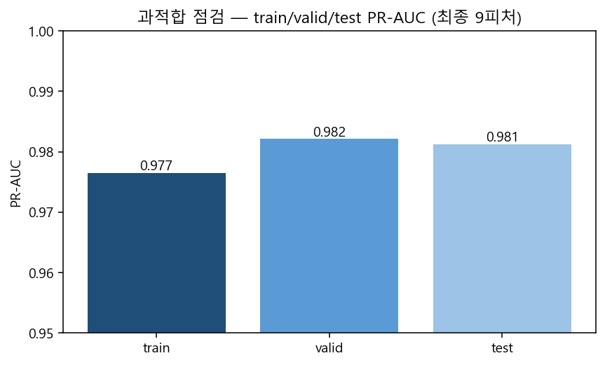
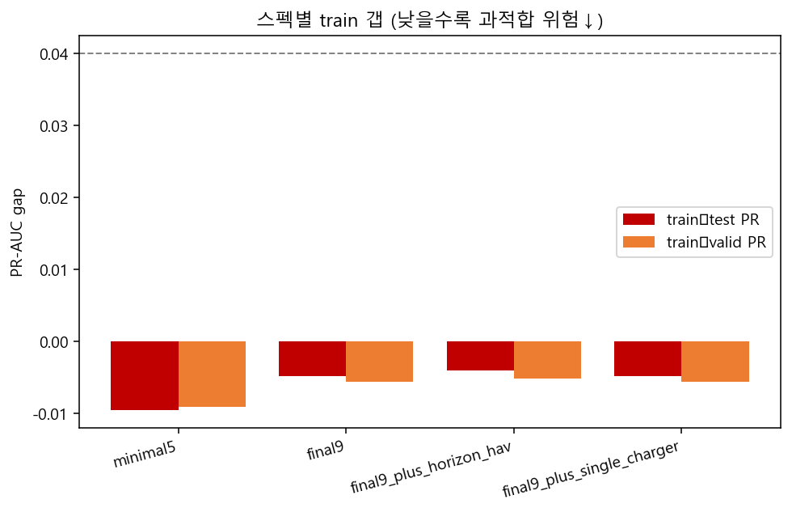
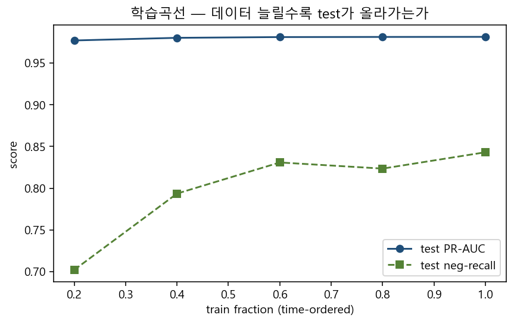
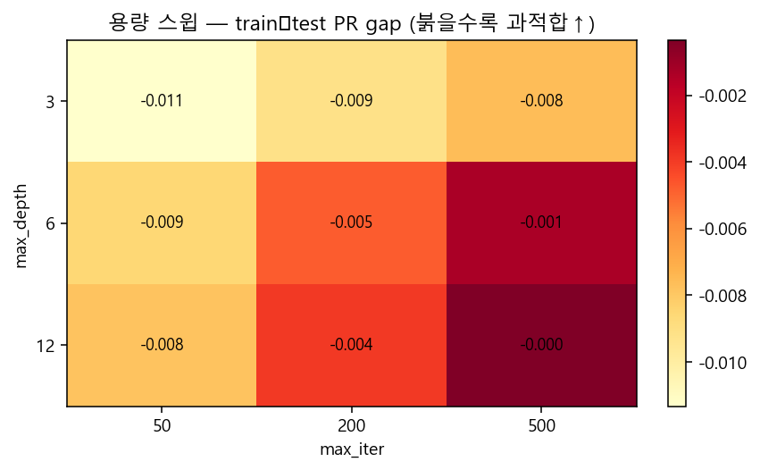
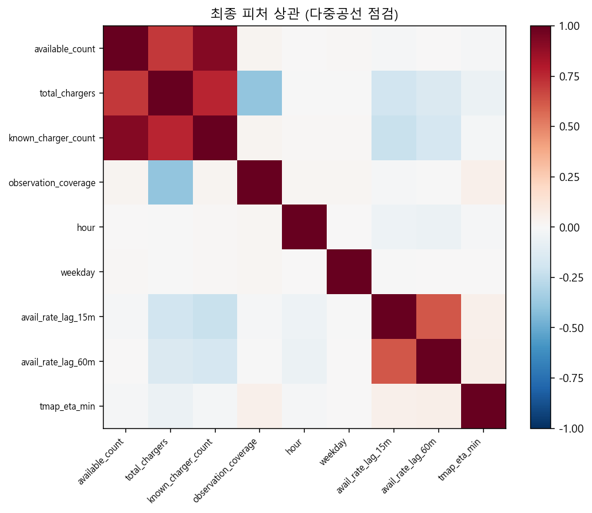

# 과적합 위험도 · HGB 도착 ETA (최종 9피처)

| 항목 | 값 |
|---|---|
| **모델** | HistGradientBoosting |
| **피처** | 최종 9 (`tmap_eta_min` 포함) |
| **종합 판정** | **PASS** |
| **train PR-AUC** | 0.9765 |
| **valid PR-AUC** | 0.9821 |
| **test PR-AUC** | 0.9813 |
| **train−test PR gap** | -0.0048 |
| **label shuffle test PR** | 0.9103 (붕괴해야 정상) |

## 체크리스트

| 코드 | 값 | 기준 | 판정 |
|---|---:|---|:---:|
| `TRAIN_VALID_PR_GAP` | -0.0056 | <=0.03 | PASS |
| `TRAIN_TEST_PR_GAP` | -0.0048 | <=0.04 | PASS |
| `VALID_TEST_PR_STABLE` | 0.0008 | abs<=0.02 | PASS |
| `LABEL_SHUFFLE_COLLAPSE` | 0.0710 | real - shuffle PR-AUC >= 0.05 | PASS |

## 해석

- train↔test PR 갭이 작으면 **외삽 과적합 신호 약함**.
- 라벨 셔플 후 test PR이 크게 떨어지면 **누수/암기 아님** (정상).
- ETA 3종 스택·파생 추가는 갭만 키우거나 이득≈0 → **넣지 말 것**.
- `|corr|≥0.7` 쌍: [{'a': 'available_count', 'b': 'total_chargers', 'corr': 0.7036065453890893}, {'a': 'available_count', 'b': 'known_charger_count', 'corr': 0.9187665065446122}, {'a': 'total_chargers', 'b': 'known_charger_count', 'corr': 0.7644242924428529}]

## 그림











## 경로

- 분석: `docs/data/analysis/hgb_overfit_risk_20260808/`
- 팀공유: `docs/팀공유/과적합위험_HGB_도착ETA_20260808/`
- D: `D:/EV_SafeCharge_DA1/BI_과적합위험_HGB_도착ETA_20260808/`

```
DA① | HGB overfit risk | 20260808
```
