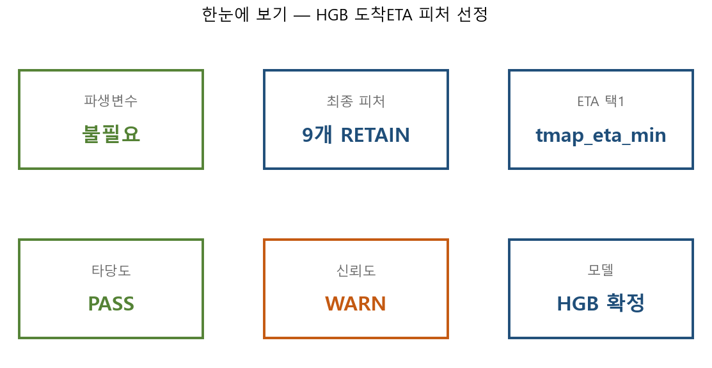
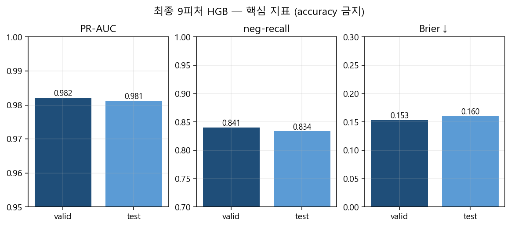
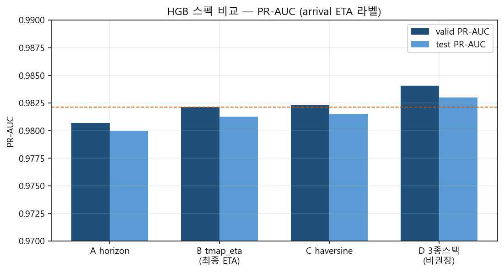
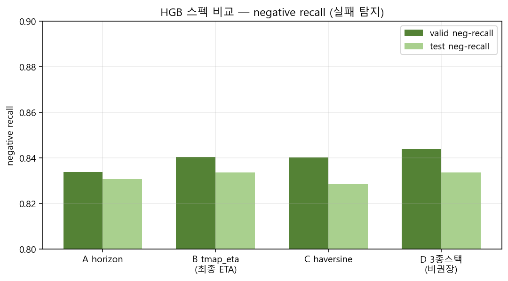
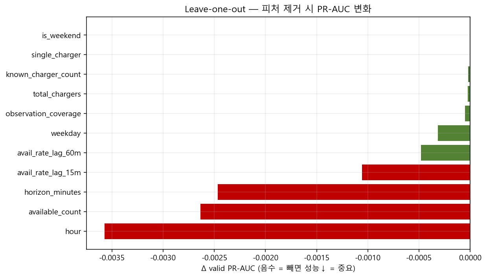
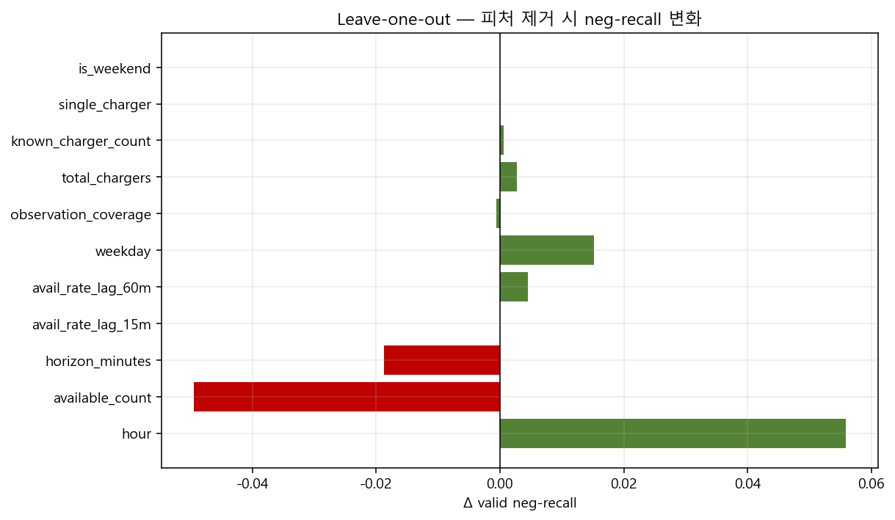
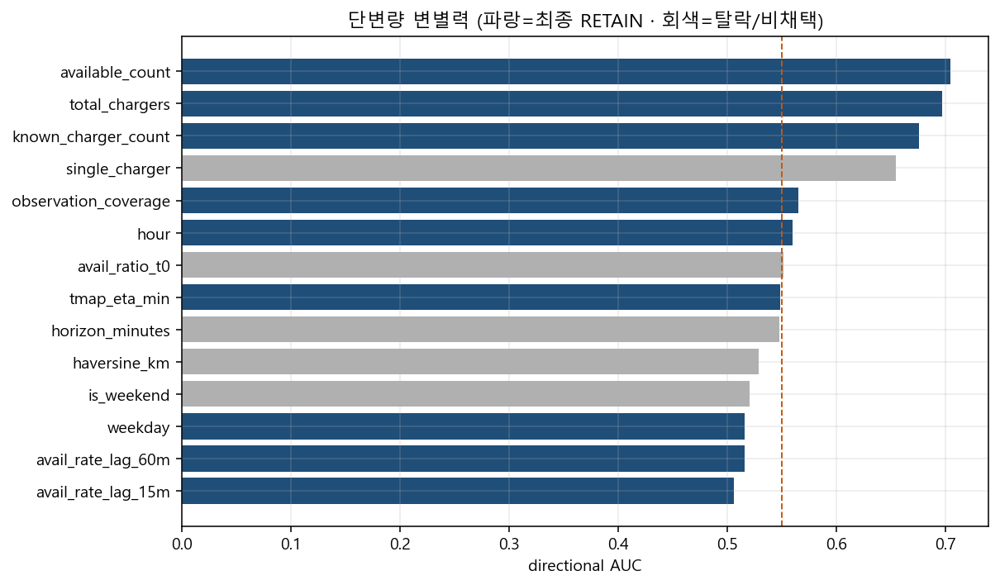
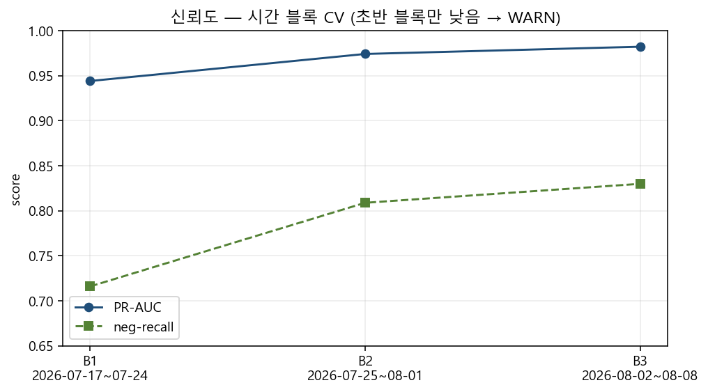

# HGB 피처 선정 BI 대시보드 (보기용)

| | |
|---|---|
| **모델** | HistGradientBoosting |
| **타겟** | `target_available_at_arrival` |
| **파생변수** | **불필요** |
| **최종 피처** | **9개** · ETA=`tmap_eta_min` |
| **타당도** | **PASS** · test PR-AUC 0.981 · neg-recall 0.834 |
| **신뢰도** | **WARN** (시간블록 CV만 경계 · valid/test·seed PASS) → [`신뢰도WARN_의미_쉽게읽기.md`](./신뢰도WARN_의미_쉽게읽기.md) |
| **D: 복사** | `D:/EV_SafeCharge_DA1/BI_피처선정_HGB_도착ETA_20260808/` |

## ⚠ 조장 필독 — ETA

학습·라벨 `tmap_eta_min`은 **동대구역 고정 origin**. 서빙 최종 3~5는 **BE 사용자 위치 TMAP**.  
→ [`../ETA_동대구고정_한계_조장필독_20260808.md`](../ETA_동대구고정_한계_조장필독_20260808.md)

## 0. 한눈에





## 1. 스펙 비교 (ETA 택1)





> B(`tmap_eta_min`)를 최종 ETA로 채택. D(3종 스택)는 소폭 우세하나 택1 계약·다중공선으로 비권장.

## 2. 피처 중요 (LOO)





> `available_count`·`horizon` 제거 시 타격 큼. `single_charger`·`is_weekend` 제거 시 Δ≈0 → 파생/중복 불필요.

## 3. 단변량 AUC



## 4. 신뢰도 — 시간 블록



> 초반(7/17–24)만 낮음. 피처 세트 붕괴 아님.

## 최종 RETAIN 9

1. available_count  
2. total_chargers  
3. known_charger_count  
4. observation_coverage  
5. hour  
6. weekday  
7. avail_rate_lag_15m  
8. avail_rate_lag_60m  
9. tmap_eta_min  

## 제외

`single_charger` · `eta_bucket` · `avail_ratio_t0` · `is_weekend` · `eta_is_proxy` · horizon/haversine(택1에서 탈락) · usage · 주차점수

```
DA① | HGB feature BI dashboard | 20260808
```
